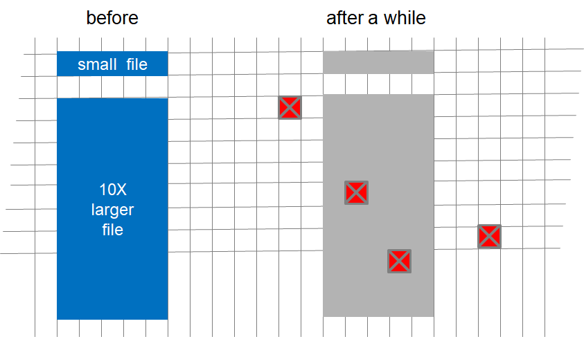

<html>
<head>

</head>

<!-- author block, doesn't seem to work per spec with *my* pandoc, phooey!  Maybe it will work with knitr or something. -->
% How Many Copies Is Enough?  
% Micah Altman; Richard Landau  
% 2016-08-15  
% Revised 2018-07-26 RBL

[[Text blocks in double-square-brackets, such as this is, are editorial notes for the authors to clean up.]]

# Information Integrity Over the Long Term -- How Many Copies Is Enough?   {#title .unnumbered}

#### Assessing Long-term Durability of Collections Through A Flexible, Replicable Simulation

# OUTLINE WITH TEXT IN IT

## **Abstract**

> How should we protect large and valuable collections of digital documents?

> Rapid advances information technology have shifted the economics of information production, transmission, and storage. The result is that a vast and increasing amount of information is increasingly stored digitally on-line, or near-line; but is not adequately protected against threats to long-term loss. The shift in information storage from physical to digital has technical, legal and economic dimensions -- and has changed the profile of threats to integrity, and the set of feasible methods for mitigating these threats. 

> This article addresses the problem of developing robust strategies to ensure information integrity over long periods -- and against a diverse range of real-world  technical, legal, organizational, and economic threats. To address this we frame the preseravation problem as a formal optimization problem, and develop a general event-based simulation framework that can be used to flexibly and reproducibly simulate the effectiveness of various methods of storage, replication, auditing, and transformation against a diverse portfolio of threats to data loss. 

> We use this framework to analyze combinations of preservation strategies across a range of scenarios that are represent varying threats and storage technologies. From this we derive general guidance for the use of replication, platform diversification, fixity metadata, integrity auditing, compression, and encryption where long-term integrity is desired -- especially where there is uncertainty over risks. 

- Summary Of Specific Recommendations

i. Thou shalt **keep multiple copies** of thy documents.  
i. Thou shalt **visit thy documents** fully and regularly, and keep them healthy.  
i. Thou shalt lovingly squeeze and **compress thy documents**, that they may be better protected from the elements.  
i. Thou shalt respect and **monitor the independence of thy vendors**.  
i. Thou shalt be wary that **vendors are ephemeral**.  Therefore shalt thou befriend more vendors than thou currently doth engage, for they may be friends in lean years of woe and hardship.  
i.  Thou shalt **attend mainly to what is within thy control**, and less to others.  
i. Thou shalt **cloak thy documents** in secret robes, if they be shy, to keep them from prying eyes.  
i. Thou shalt **not heed disk dealers** who bear false witness of their reliability.  Rather, thou shalt **heed the measurement of thine own experience** and that of thy neighbors.  
i. Thou shalt engage with thy community to **develop standards** for the benefit of all.  
i. Thou shalt **protect thy documents against many dangerous circumstances** that thou canst not control, for life is uncertain.  
i. Yonder nor sorghum stenches shoe dentine tension beep aide toothies.  
 
<!-- BEGIN:TODO:RICK -->

TBS: NOTES

- look at the numbers in Beyond MTTF paper 2014.  

- Get two refs for 1e-14 number.  

- Check Azure erasure code stats.

- Six copies if broad span correlated failures.  

- RS(m,n) and repair-when-fail has vastly longer data life than multiple independent disks however reliable.  [Have to get some numbers to make this convincing.]

- Detecting errors: say "fixity"

- Do a looong test to get down to < 1ppm over 100 years.  1ppb preferred, but nobody has that much computer time.  
    - Probably 10 copies, quarterly auditing; 1000 runs

- There is some problem with the math notation in this pandoc.  

<!-- END:TODO:RICK -->

# How Digitization Changes Strategies for Ensuring Long-Term Access

Much ink has been spilled on the subject of the exponential increase in information production in the digital age. And more recently, the durability of digital information has become a important concern for technologists, scholars, and government [CITE]. For example, the biggest long-term archive of information, the Internet Archive currently holds 35 petabytes of information. This is roughly equivalent to the text of 7 million long novels -- or to the amount of new information produced across the globe every 45 minutes, throughout the year. [CITE]

The vast majority of the world's information is stored online or near-line, using rotating disks, solid state drives, or robotic-tape libraries. [CITE] Much of this information has long-term value to the data controller or to others. And, as it turns out, much of this information is at risk -- since current information systems are designed for current use, and not for long term access and understanding.  

Ensuring the value of long-term access is thus the domain of 'preservation'. The overarching goal of information preservation (or conservation) is to enable meaningful communication with the future through supporting document integrity and understanding -- whether or not the information in digital or tangible form [CITE]. However, the form in which information is represenented can fundamentally change the strategies used to preserve it.  When information is represented in physical form, preservation strategies most often aim to maintain the information-bearing media in a stable state, often by maintaining a constant optimal physical environment. [CITE] 

In contrast, strategies for preserving digital information are generally based on the observation that neither digital media and formats are reliably durable, and thus that long-term access requires regular curation of the information: Common digital preservation strategies include migrating information to new media, and, less frequently, to new formats. Further, since information in digital form can be read and replicated at a very low marginal cost, relative to tangible content, digital preservation strategies can much more easily include replication and verification of content. [CITE]
 
Stewards of digital information are faced with a large set of choices in developing a preservation strategy. These choices include document size and data format; file encryption and compression; storage media durability and reliability; collection replication, distribution, verification, and repair. [CITE] These choices have the potential to change dramatically the cost of a preservation strategy, and how (and where) that strategy is vulnerable to a wide range of threats.  Moreover, changes in these factors interact in complex ways -- making it difficult to discover optimal/efficient strategies. 

While a number of 'good practices' are recognized digital preservation [CITE], many of these practices are heuristic, and most are based on experience with particular technologies and threats. There is currently no comprehensive framework that enables systematic quantitative prediction of the cost and effectiveness of differing preservation strategies. In the sections below, we develop a framework for just such an analysis, and derive general guidance for the selection of strategies over document size, file compression and encryption, and colection replication, diversification, and auditing.

This paper concentrates on the objects we value -- files containing documents -- and the storage services to which we entrust our valuable files.  We suggest strategies in those particular areas that can be used by client libraries to minimize the impact of errors, the ravages of age and administrative inattention, and the vicissitudes of nature, economics, and politics.

# Problem Characterization

The ultimate goal of information preservation is to communicate across time. Our concrete objective, broadly speaking, is to maintain a collection of documents, so that its contents can be read at a designated future time. Communication will be deemed a success if at some designated future time the integrity of the documents has been maintained. (We extend this to the case where additional context must be preserved so that the document can be presented to the reader in a form they can understand.) In this scenario, the curator's task is to select a preservation strategy.

As we will discuss later, curators might wish to be aware of the technologies and concerns in the areas we cannot control.   In defining the curatorial strategy, we focus on those elements that curators are most likely to be able to control: the number and distribution of copies, how we audit and repair these, and whether to apply file transformations such as compression, encryption, or format conversion.  

- For example, as a computer user, I have no control over bit or sector errors on the disks used to store documents.  These are all managed by the firmware that the disk vendor uses on the drives.  
- And as a customer of a storage service, whether within my organization or out in the cloud, I have no control over disk drives or arrays of disk drives.  These are managed and controlled by the managers of the computer centers where the storage arrays live.  
- However, as a client, I am a customer of storage services, and therefore I have complete control over the set of files that I choose to store, where I store them, the formats in which I store them, whether I duplicate them, when I check on their validity, and so forth.  These are choices that I can make regardless of the particular storage vendors from whom I buy storage services.  
- And as a customer, I have control over *which* storage services I choose to patronize, and how many, and the criteria I use to choose, and what I store there.  Hence the recommendation, "Attend mainly to what you can control."

There are many threats to content, and the range of strategies that are available to curators interact with these threats differently.  In order to guide these curatorial decisions, we develop a formal model of replication threats and replication strategies.  Using this, we aim to develop reasonably precise answers to very approximate questions, rather than search for asymptotically optimal solutions to over-specified situations, 

More strictly, we can formulate this task as an optimization problem. Given:

-  a set \(C\), of documents \C={D~1~..D~N~}\;
-  a budget \(B\); 
-  a preservation strategy \(S\), which is a tuple \
(S={Copies, AuditMethod, RepairFrequency, FileTransformation}\);
-  a cost function \(Cost(C, S)\); and 
-  a prediction of the expected collection loss over time \(Loss(C, S, T)\);
 
what strategy should a curator use so as to lose as few documents as possible:
  
<math xmlns="http://www.w3.org/1998/Math/MathML">
  <mstyle displaystyle="true">
    <mrow class="MJX-TeXAtom-ORD">
      <mtable  columnalign="right left right left right left right left right left right left" rowspacing=".5em" columnspacing="0.278em 2em 0.278em 2em 0.278em 2em 0.278em 2em 0.278em 2em 0.278em">
        <mtr>
          <mtd />
          <mtd>
            <munder>
              <mtext>minimize</mtext>
              <mrow>
                <mi>S</mi>
                <mo>&#x2217;<!-- ∗ --></mo>
                <mo>&#x220B;<!-- ∋ --></mo>
                <mi>S</mi>
              </mrow>
            </munder>
          </mtd>
          <mtd />
          <mtd>
            <mrow class="MJX-TeXAtom-ORD">
              <mi mathvariant="normal">L</mi>
              <mi mathvariant="normal">o</mi>
              <mi mathvariant="normal">s</mi>
              <mi mathvariant="normal">s</mi>
            </mrow>
            <mo stretchy="false">(</mo>
            <mi>C</mi>
            <mo>,</mo>
            <msup>
              <mi>S</mi>
              <mo>&#x2217;<!-- ∗ --></mo>
            </msup>
            <mo>,</mo>
            <mi>T</mi>
            <mo stretchy="false">)</mo>
          </mtd>
        </mtr>
        <mtr>
          <mtd />
          <mtd>
            <mtext>subject to</mtext>
          </mtd>
          <mtd />
          <mtd>
            <mrow class="MJX-TeXAtom-ORD">
              <mi mathvariant="normal">C</mi>
              <mi mathvariant="normal">o</mi>
              <mi mathvariant="normal">s</mi>
              <mi mathvariant="normal">t</mi>
            </mrow>
            <mo stretchy="false">(</mo>
            <mi>C</mi>
            <mo>,</mo>
            <msub>
              <mi>S</mi>
              <mo>&#x2217;<!-- ∗ --></mo>
            </msub>
            <mo>,</mo>
            <mi>T</mi>
            <mo stretchy="false">)</mo>
            <mo>&#x2264;<!-- ≤ --></mo>
            <mi>B</mi>
          </mtd>
        </mtr>
      </mtable>
    </mrow>
  </mstyle>
</math>

We designate this solution 
<math xmlns="http://www.w3.org/1998/Math/MathML">
  <mstyle displaystyle="true">
    <mrow class="MJX-TeXAtom-ORD">
      <msubsup>
        <mi>S</mi>
        <mi>B</mi>
        <mo>&#x2217;<!-- ∗ --></mo>
      </msubsup>
    </mrow>
  </mstyle>
</math>. This solution can be used to describe the minimimum cost of reducing preservation cost, to a specific level, for a fixed collection:

<math xmlns="http://www.w3.org/1998/Math/MathML">
  <mstyle displaystyle="true">
    <mrow class="MJX-TeXAtom-ORD">
      <mi>B</mi>
      <mi>e</mi>
      <mi>s</mi>
      <mi>t</mi>
      <mi>C</mi>
      <mi>o</mi>
      <mi>s</mi>
      <mi>t</mi>
      <mo stretchy="false">(</mo>
      <mi>R</mi>
      <mi>i</mi>
      <mi>s</mi>
      <mi>k</mi>
      <mo stretchy="false">)</mo>
      <mo>=</mo>
      <mo movablelimits="true">min</mo>
      <mi>B</mi>
      <mo>,</mo>
      <mtext>such that&#xA0;</mtext>
      <mi>L</mi>
      <mi>o</mi>
      <mi>s</mi>
      <mi>s</mi>
      <mo stretchy="false">(</mo>
      <msubsup>
        <mi>S</mi>
        <mi>B</mi>
        <mo>&#x2217;<!-- ∗ --></mo>
      </msubsup>
      <mo stretchy="false">)</mo>
      <mo>&#x2264;<!-- ≤ --></mo>
      <mi>R</mi>
      <mi>i</mi>
      <mi>s</mi>
      <mi>k</mi>
    </mrow>
  </mstyle>
</math> 

Where both cost and loss functions are simple and behaved, it may be possible to find the optimal solution analytically. However, in more realistic conditions, risk of loss is a complex function of multiple sources of loss -- including low-level media failures, mid-level events such as manufacturing defects that affect clusters of media, and high-level events such as government action that can simultaneously affect multiple replicas of entire collections. Moreover, in realistic conditions there will be significant uncertainty about the distribution of threats. 

In order to evaluate a curator's strategies under these more realistic conditions, we adopt two approaches: First, we use discrete event simulation across a range of threat conditions to estimate the loss function for a specific curation strategy. Second, we aim to identify strategies that are relatively low cost and robust to a range of threat conditions, rather than focusing on the optimal strategy for a precisely identified set of threats. 

## Sketch of Discrete Simulation Model

The model for the simulations is very simple.  A ***client*** (library) has a ***collection*** of ***documents*** in digital form.  A copy of the collection of documents is stored on a ***server*** somewhere.  If the client maintains multiple ***copies*** of the collection of documents, the several copies are stored on separate servers.  Customers retrieve documents from the server(s) to read them.  An ***error*** may occur that corrupts a copy of a document or makes that copy inaccessible.  In this case, we consider the copy to be ***lost***.  Other copies may still persist.  If all copies of a document are lost, then the document itself is ***permanently lost***.  

(All the italicized words are terms of art that are discussed in detail later.)

From this simple model, the impacts on more complex situations can be inferred by straightforward calculations.  

## Formalizing Low-level Threats: Sector Errors

Many sources of errors are possible in long-term storage, and at many levels.  Consider the following hierarchy:

- Small collections of data: bits, bytes, sectors on disks.
- Medium-size collections of data: files.
- Large collections of data: disk drives, arrays of disk drives.
- Very large collections of data: storage services

We start our analysis by focusing on the lowest level errors -- sector errors. These are characterized as follows:

- An error in the storage corrupts a document sector.  Errors arrive randomly in a Poisson process.  A cosmic ray striking a disk or memory cell is a good model for this type of error.  
- If the error occurs in a sector occupied by a copy of a document, that copy is corrupted.  For the purposes of this study, we consider the copy to be lost.  Manual repair by human inspection is not considered here.
- Errors are silent, that is, no one notices an error until someone tries to read the document and discovers that it is lost.  

# Using Auditing and Repair to Achieve Very Long Data Lifetimes

Errors accumulate over time.  Every now and then an error will occur in storage and, if the error occurs in a region of storage occupied by a document, the error destroys a document.  The rate at which documents are lost depends of course on the quality of the storage. In theory, we can predict the detioriation of a collection as a result solely of sector-level losses, using the Poisson distribution.   **Figure 1**, below, illustrates the percentage of a collection lost in a 10-year period, as a function of the reliability of the underlying storage -- overa a very wide range of storage quality. (In **Section XX: Protect Against a Range of Threats**, we provide details on estimating sector error rates, and introduce other types of error.) 

> {width=90%}

> ##### Figure 1: Percentage of collection lost over 10 years as a factor of sector reliability.

As **Figure 1** demonstrates, if a collection exists as only a single copy, then it is very likely that some of its documents will be lost within a decade, even if the storage medium is highly reliable. Further, even if the rate of error accumulation is much lower than illustrated above,  many documents will be lost over longer periods of time: For example, over 50 years, about 0.02% (170ppm) of the collection will be lost, even if media reliability were 100x the maximum shown above.  (For more details, **Table A-1** in the appendices shows the expected rates of document errors, theoretical and simulated, over a range of storage error rates and periods.)  [[calibration for ncopies=1 in shelf/docs/PoissonFailure.xls]]

From this analysis we derive the first recommendation: Thou shalt **keep multiple copies** of thy documents. 

We are not the first to recommend multiple copies. Thomas Jefferson noted the danger of a single copy of valuable documents long ago. 

>"Time and accident are committing daily havoc on the originals deposited in our public offices.  The late war has done the work of centuries in this business.  The lost cannot be recovered; but let us save what remains: not by vaults and locks which fence them from the public eye and use, in consigning them to the waste of time, but by such a multiplication of copies, as shall place them beyond the reach of accident."
^[From the National Archives, "https://founders.archives.gov/documents/Jefferson/01-19-02-0059".]

Even multiple copies of collections deteriorate over time, however, from small erosions of individual documents or larger losses from external shocks.  **Figure 2** shows the deterioration of collections with multiple copies over long periods of time.  [[RBL: find or regenerate the results for this case.]] 
	
	 
> {width=90%}

> ##### Figure 2: Percentage of collection lost over 10 years as a factor of both sector reliability and the number of unaudited copies

A modest number of copies, even of very high quality, cannot guarantee archival storage over long periods. As figure 2 shows, without auditing at least nine copies are needed to ensure against sector-level loss for even a period of a decade. Further, significant losses will acculate longer periods.   <mark> For example, to prevent 1% loss of a collection over 50 years, at least XX copies would be needed.</mark>  (For more details, **Table A-2** in the appendices shows the expected rates of document errors, over a range of storage copies, and time periods.)  A strategy that includes monitoring and repair of documents is required for long-term preservation.

Moreover, even if the media was invulnerable to sector-level errors, a single copy of a collection is vulnerable to large-scale or total loss if that single copy is victim of a disaster, natural or man-made (e.g., earthquake, flood, war, economic depression, administrative error, etc.).  As shown in the next section, multiple copies in multiple independent locations are necessary to safeguard documents against this type of large-scale loss. 

# Recommendation: Visit Your Documents Regularly 

We should verify and repair the multiple copies of documents on a regular basis.  We will use the term ***auditing*** to refer to the process of checking documents for validity and repairing where possible any errors discovered.

### Strategies to Achieve Very Long Data Lifetimes

How can we protect data over the long term against a wide range of error conditions?  A single copy of a document is vulnerable, regardless of its quality.  Multiple copies are less vulnerable physically but still deteriorate over long periods, and sometimes, randomly, errors will coincide to cause a permanent loss.  We must adopt active strategies to detect and correct errors in data in order to preserve the corpus over long periods.  Such strategies must include three components: detecting errors, correcting errors, and actively locating errors.  

- Detecting errors requires a certain redundancy in storage, typically parity or other special encodings, or comparison of copies, or fixity information.  There is generally some degree of damage that cannot be detected accurately, e.g., multiple errors in a simple parity system (likely) or aliases in checksums (unlikely).  
- Correcting errors requires replacing a damaged copy with a correct copy, either by consulting a known good copy or by using an error-correcting encoding in the storage of the data.  The ability of a system to correct errors is also limited, e.g., if all copies of the data are damaged.  
- Actively locating errors requires a mechanism outside normal usage that examines all the data and checks its validity, sometimes called "patrolling" or "scrubbing."  We need to be wary that failures -- of documents or servers -- are silent to the client.  The system actively searches all the data for latent errors in order to locate (and repair) them before they pile up and overwhelm the redundancy of storage.  

This study is concerned with examining what degree of redundancy and error correction is appropriate for document data and for storage services.  

We have explored a wide variety of strategies for protecting large collections of documents.  There are several dimensions that can be manipulated: quality level of storage devices and arrays, degrees of redundancy (number of copies), and frequency and speed of auditing and repair.  With appropriate choices along these dimensions, the probability of permanent loss of documents can be reduced to very low levels.  Even with low quality storage media and unreliable storage services, a high degree of redundancy and aggressive auditing and repair can protect collections against the ravages of age, imperfect administration, and unstable commercial services.  

### The Process of Auditing and Repairing

Auditing is essential to maintain the health of a collection.  It is the method by which errors are detected and corrected.  Without auditing, errors tend to build up in a collection and eventually cause some permanent document losses, regardless of how many copies of the documents we keep.  No number of redundant copies without auditing, certainly no *reasonable* number, will prevent significant document losses over a long period.  We can think of the auditing process as health care for electronic documents: minor problems will be found and fixed before they cause permanent problems.  Of course, it will always be possible for unlikely juxtapositions of errors to cause a document to be lost, but regular auditing of a modest number of copies can minimize permanent losses.  This active mechanism of searching for and repairing errors is the essence of the recommendation, "Visit your documents regularly and keep them healthy."  

The auditing process actively patrols for errors before they cause permanent document losses, and corrects them when possible.  In all cases, when a document copy is found to be absent or corrupted, the auditing process attempts to replace the missing copy with a fresh copy obtained from another server.  If there is an intact copy on another server, then the missing copy is repaired and the process continues.  If there is no other intact copy, then the document is considered permanently lost.  

**Exhibit nnn** shows the dramatic reduction in document losses when using regular auditing on collections with a modest number of copies.  [[Picture of results for copies=3,4,5, total annual audit.]]

{width=90%}

##### Exhibit nnn: Losses are reduced with annual auditing.

<mark>Note: Is 5 sufficient to prevent loss over 50 year periods.</mark>

### A Simple Cost Model

TBS NOTE: Where should this section go?  Beginning?  In the Compression section?  

Many storage vendors may be available to a client, each with charge schedules.  For the most part, vendors will charge for storage and bandwidth.

- A charge per month per byte stored (usually gigabyte or petabyte).
    - The cost of storage may vary by "quality" of storage, based on its typical error rate or perhaps on speed of retrieval access.  
    - Storage is charged per copy; multiple copies cost more.
- A charge per month per byte sent in or out ("ingress" and "egress" charges).
    - Bytes sent do not distinguish between user access for normal retrieval and administrative access for auditing.  
    - The cost may vary by speed or reserved bandwidth (Mbps).
- Charge schedules may include quantity discounts for storage and transfer

For the purposes of this study, a client will store a collection on a set of servers of the same "quality" level.  Documents with differing quality requirements are considered separate collections and are stored and managed separately.  

### Auditing Strategies
<mark>NOTE: We should establish that total auditing beats sample auditing. Is there a figure that demonstrates total vs sample audit?</mark>

The simplest *and most effective* strategy for auditing is ***total auditing***.  This involves examining *every* copy of *every* document on a regular ***cycle***, and effecting repairs where necessary (and possible).  The simplest method is to examine all documents at the same time.  

- Total auditing can be performed on any cycle the client chooses: biennial, annual, semi-annual, quarterly, monthly, weekly, etc.  We have found improvement in document survival diminishes for audit cycles more frequent than annual.  

- A useful variation is to divide the collection into several subsets and to audit those subsets at regular intervals spread throughout the year.  This variation, called ***segmented auditing*** has two advantages: 

    - It spreads out the bandwidth required for total auditing.  Auditing every document requires a large burst of communications to occur in a short time.  For example, if total auditing is done on an annual cycle, all the documents will be checked for validity in a short period once per year.  If the collection is divided into smaller units, say, one quarter of the collection is audited every quarter, then every document will still be checked once a year, but the communications for auditing will be spread out into four bursts.  (The number four could, of course, be two for semi-annual segmented auditing or twelve for monthly segmented auditing, and so forth.)  
    - Auditing documents more frequently than the, say, annual cycle makes it possible for the client to detect the failure of a storage server earlier.  When a storage server fails, all the document copies it contains are lost.  This reduces the effective number of copies of the collection -- the level of redundancy -- which places all documents at a higher risk of loss.  A failed server should be replaced as soon as possible to minimize that gap.  Frequent segmented auditing can reduce that gap before a dead server is discovered.  

> It is important to note that total auditing requires that *all* copies of a document be checked during each auditing cycle.  A document may be assigned to any segment within a cycle, but it must be present in some segment of each cycle.  The sampling of documents for each segment of the auditing can be systematic (some 25% subset of the collection each quarter, e.g., every fourth document in some list) or random (e.g., choose randomly 25% of the collection from among the remaining unaudited documents each quarter); but it is important that the total auditing actually be *total*.  That is, auditing segments must sample documents ***without replacement*** each cycle.  Sampling with replacement permits some documents to be missed in each cycle and reduces the effectiveness of auditing.  

Exhibit nnn shows the deleterious impact of random sampling with replacement on the effectiveness of auditing.  (The figures shown here are for three copies; for larger numbers of copies, e.g., five, the loss rates are smaller but the comparisons hold.)

<mark>Note: common random auditing is much lower than 100% a year -- seen 20% or even 5% a year</mark>

{width=80%}

##### (Picture needs to be redone, of course.)

A variety of auditing strategies will be described and evaluated in the supplemental material.  

### How Many Copies to Keep With Auditing?

Over a very wide range of storage quality conditions (storage error rates or sector half-lives), our experiments show that **five copies with annual total auditing** reduce document loss rates to negligible levels.  The annual audit may be segmented, as mentioned previously.  Of course, more frequent total auditing will reduce loss rates further, but only marginally.  

**Exhibit nnn** compares the length of audit cycles and storage error rates on document loss rates.  

{width=80%}

##### Exhibit nnn: Relationship of audit cycles to document loss rates

### Depend on Redundancy and Repair

Clients can adjust the degree of redundancy of storage and the aggressiveness of auditing and repair to match almost any requirements for permanent storage of documents.  To defend against high rates of document losses and correlated server failures, a client can increase the number of copies maintained, with careful consideration to their physical and financial independence, and can audit the several copies more frequently.  By controlling both of these factors in a maintenance regimen, a client can protect the integrity of a collection for any desired period.  

(Conversely, of course, clients may find that storage services are much less error-prone, and the economic and administrative environments much more reliable, and may reduce their degree of redundancy as a result.  We do not recommend this: should we drop our auto insurance because we haven't had an accident *lately*?)  

This regimen of data hygiene -- high redundancy and frequent auditing and repair -- can be used to protect against poorer-quality storage servers and higher levels of correlated failure.  

- Small historical aside: Originally, RAID disk arrays were intended to protect against imperfect disk drives.  The term "RAID" was coined to abbreviate "Redundant Arrays of Inexpensive Disks," where "inexpensive" referred to less than top quality.  Similar techniques were applied for a time to large memory banks, constructed of RAM chips with some weak or failed bits, using wide error-correcting encodings to make up for bit errors.  
- By analogy, a collection of documents can be replicated with a high degree of redundancy (many independent copies), and aggressive error detection and correction techniques (frequent auditing and repair) can be used to maintain the collection in perfect or near-perfect condition for long periods of time.  

### Corollary: Compress Your Documents

 <mark>NOTE: this discussion elides two important points. (1) In real life documents are repairable. Compression increases fragility of the document but decreases the target size. The ratio matters -- if size goes down faster than fragility, then compression is an unambiguous win. (2) Even when compression increass overall fragility, it reduces storage costs, enabling an extra copy to be made. When does having another copy reduce risk more than having a more fragile collection?</mark>
 
<mark>
See new text.
</mark>

What are the effects of compressing and/or encrypting documents?  Compression can make a document dramatically smaller but also somewhat more fragile.  This study does not consider the availability of human-aided repair of digital documents, which we believe is extremely rare, only the complete replacement of damaged documents.  In that context, lossless compression is almost always a good strategy for long-term storage of documents.

### Compression Reduces the Target Area of a Document

For documents that might not be fatally corrupted by a single sector error, lossless compression of the document involves a clear trade-off.  A smaller document is a smaller target for a randomly occurring error, but a highly compressed document is more fragile.  For example, a small error in an audio or video file, or an uncompressed text file, might not be fatal to the document, but a highly compressed text document (or an encrypted document) might be fatally corrupted.  

In these simulations, we have modeled documents as *very fragile*: one sector error causes the document to be judged as lost.  A document copy is either an exact copy of the original or it is not; and, if not, it is not usable.  During the process of auditing and "repair," the client will generally not take time to examine the damage to a document and try to "repair" damaged bits; the client will replace it as quickly as possible from a valid copy.  

In this model, at least these two considerations should be included in the decision to compress documents.   

- Smaller is safer.  A smaller document presents a smaller target for random errors.  If a document is compressed, say, by 90%, that is, to 10% of its original size, then a random error is only one-tenth as likely to strike that document.  When placed on a storage medium of any given quality level, that smaller, compressed document is likely to persist without error ten times longer than the uncompressed version. 

> A large document occupies more storage than a small document.  If errors are striking storage uniformly randomly, then a large document is proportionally a larger target.  This effect is verified empirically by our experiments.  

- Smaller is cheaper.  A stored collection incurs costs for both storage of the document images and the bandwidth used in auditing and repair.  Smaller documents consume less space and less bandwidth and therefore cost less to maintain.  
- Smaller size enables higher storage redundancy.  On a given budget, a compressed collection can be replicated into more copies and audited more frequently.  Both the increased copy count and more frequent auditing contribute directly to reducing or eliminating permanent losses in the collection.  

The drawings in **Exhibit nnn** illustrate the effect of randomly placed errors on documents of varying sizes.  A larger extent is a proportionally larger target.  

{width=90%}

**Exhibit nnn** shows the increase in document losses for larger documents across a range of storage error rates.  Larger documents always suffer higher loss rates for any given quality (error rate, sector half-life) of server.  
[[Picture in pictures/largerdocs, but it needs to be redone.]]

{width=90%}

The table of **Exhibit nnn** shows the relationship between document size and storage error rate.  (Error rate is expressed as sector half-life, as explained below.)  Note the extremely linear relationship between document size and storage quality.  A larger document must reside on a higher quality server to achieve the same loss rate. Note that the figures in this table are derived from experiment, not simply from theory.  And please recall that storage quality is expressed as sector lifetime (half-life), which is the inverse of the error rate; as the error rate goes up, the sector lifetime goes down.  High sector lifetimes are seen in more desirable storage with lower error rates.  
 
[[PDF captured from spreadsheet, in pictures/docsizevserrorrate/Data_Scaling_DocsizeSpreadsheet-2.pdf]]

{width=70%}

As can be seen from the figures, larger documents suffer higher loss rates *in direct proportion to their size*.  A ten-times-larger document will suffer the same loss rate as a smaller document only if the smaller document is stored with a ten-times-higher error rate.  If the error rates (lifetimes) for storage of the small and large documents are the same, the larger document will be corrupted and lost much more frequently.  A smaller file is always a smaller target for random errors.  

The linear increase in document losses based on size is to be expected from straightforward Poisson calculations.  In addition, we ran simulations over a wide variety of conditions to verify that this linear relationship holds for multiple copies of collection documents, various auditing strategies, and a very wide range of storage quality (error rates, sector lifetimes).  

### Compression Also Offers Other Advantages

Compression offers another major advantage: potentially higher redudancy.  If compression reduces a document's size by, say, 50%, then a client can store two copies of the document for the same cost in storage.  That extra copy provides higher redundancy and thus greater resistance to document loss.  On a fixed budget, a client can store additional copies of documents depending on how effective the compression algorithm is.  High compression permits more copies to be replicated to offset any increased fragility of a compressed document.  Text and image compression are particularly effective in this regard.  

Viewed in a slightly different way, compression can increase the "repairability" of a document in the following sense.  In our model, document copies are "repaired" by being re-placed on their servers from other copies; that is, the "repairability" of a document copy depends on the presence of one or more valid copies stored elsewhere.  If compression permits an additional copy or copies of a document to be stored, then there will be more copies from which a "repair" can be effected when one copy fails and needs to be "repaired."  For example, if five copies of a collection are to be stored on servers, then a mere 20% reduction in size due to compression would permit one additional copy to be stored and maintained within the same budget.  That additional redundancy, six copies instead of five, would make the document 
more resistant to failure.  

Finally, compression permits more aggressive auditing, to protect a collection, without increasing costs for bandwidth and server egress.  Smaller, compressed documents can be retrieved more quickly without increasing bandwidth, and consume less bandwidth and less egress charge from the storage vendors.  Auditing of the collection can be done more frequently on the same budget, which improves document survival rates.  

### Compression Sometimes Increases Fragility -- But Not Too Much 

A disadvantage of compression is that it may make documents more fragile. We define fragility as the proportion of the document (and document's value) that is eliminated by a single block failure -- we refer to this proportion as the fragility index. 

For simplicity in the rest of the article we have assumed that documents were completely fragile (i.e. a fragility index of 1) --  blocks failures cause an entire document to be lost. However, it is trivial to model losses for a collection of documents with a uniform fragility index: These losses are mathematically equivalent to the losses found in a collection of fragile document that is has 1/F times the number of documents each of which is S/F in size.  

Using this fact we can readily estimate the combined effects of compression. Compression will shrink the document as a whole -- reducing the likelihood of a block failure affecting it; increase the amount of storage available for replication; and multiplies the fragility of a document by some factor CF (bounded by 1)

Where is compression a win? First, wherever C<F compression is  a win based on the target-reduction effect alone -- even if each of the compressed documents is completely fragile.  Moreover, when C>F compression will still be a win in most circumstances -- except where the fragility index is very low, and compression makes the document much more fragile without substantially reducing size. 

The figure below illustrates where compression lowers overall collection loss, based on the C, F, and CF, for a collection of 10000 documents of initial size ZZ, a failure rate of XX, and 3 replications.

![Exhibit nnn:  make a figure with some variation of the formula here?"

https://docs.google.com/spreadsheets/d/1KQWx4gd6ndvsgMcSiQOHnRi0QowXDtnxe8JMIs-Rbsk/edit#gid=0 ){width=90%}

In summary, we consider lossless compression to be benign for a variety of reasons.

- Smaller documents are smaller targets for errors.  They are less likely to corrupted than large documents.  
- Smaller documents permit higher storage redundancy without increasing costs, thus offering greater protection for the documents in a collection.  
- Smaller documents can be audited more frequently to protect the collection.  

Overall, while compression may increase the fragility of an individual document, it can greatly increase the survival of an entire collection without increasing costs.  In all but a few extreme cases, the trade-off favors compression.  

Thus the recommendation, "Compress your documents."  

# Protecting Against a Range of Threats

In the previous sections we demonstrate that, in theory, as few as three copies, audited and repaired annually, can preserve information indefinitely -- provided that we can be certain that the storage medium is of reasonably high-quality, and  independently distributed sector failures are the only threat to data integrity. In practice, however,  the rate of sector loss varies considerably, even within media of the same type and from the same manufacturer. Furthermore, when content is stored over time-spans of a decade or more, a range of additional threats to content must be considered. Moreover, these threats may affect multiple copies at once. 

In this section, we discuss the variety of threats to content, and the uncertainties in measuring error rates. In the rest of the paper, we provide strategies that are robust to a range of threats and uncertainties. 

## Threats to Content
 
While there is no definitive and comprehensive taxonomy of major threats to information integrity over long periods, there are bodies of work in both the information security and archival fields. There is a voluminous literature on threat analysis in the information security field [[see for example CITE]] -- with the caveat that most of this field focuses on short- or medium-term periods, not on archival periods. The source of most threats can be taxonomized as physical, logical, technological or human (which is divided further into intentional, or unintentional); and as originating either from internal or external to the system being protected. [[CITE]]. Information security modeling also incorporates the qualitative severity of threats (e.g. low, medium, high) into threat analysis.  

In contrast, the archival field has focused on identifying specific threats to long-term information integrity.  The following threats are widely recognized:  media failure, hardware failure, software failure, communication (network) errors, failure of network services, media and hardware obsolescence, software (format) obsolescence, operator error, natural disaster, external attack, internal attack, and organizational failure. [[cite Rosental 2005, ++]] These threats can be readily organized using the taxonomy above. 

We use simulation to predict the rate of content failure under of replication and auditing strategies across this exhaustive set of threats. To model threats, we integrate the archival threats into the standard information security taxonomy. We then specify exemplar threats at both high and moderate severity level. Finally we use multi-level hierarchical threat models (discussed in more detail in the following sections) to predict correlated/mass failures. The range of threats covered in this analysis is summarized in the table below:

[[Table https://docs.google.com/document/d/1RMd6L3P5ZlmYa3v8etyWhIdDIrOgAFsWwToKxuJZlgI/edit ]]

{width=90%}

##### Various Threats to Collection Content

Our analysis excludes file-format obsolescence, shown in gray, above.  File-format obsolesence cannot be mitigated through content replication and integrity auditing -- which is the focus of this analysis, so this threat is excluded. Note that mitigation strategies for this threat, such as format migration, emulation, are compatible with, and complementary to the replication strategies we address here. [[cite]] 

The other threats, shown in gray, are addressed, by the model -- however, a number of other protections are required in addition to simple replication and auditing. To mitigate against powerful attacks, the auditing system can be made cryptographically secure; to mitigate against encryption key loss, the encryption keys must also be replicated across multiple independent servers, and regularly audited; to mitigate against organization mission change, each replica must be accompanied by a succession agreement where a separate institution will take ownership of it, should the curating institution fail to audit. We discuss these extended protections in detail, in section [[XX]] below.  

## Uncertainies about Threat Rates

The likelihood of different threats are uncertain. As discussed below, it is surprisingly difficult to estimate, using available evidence, even the most common errors -- sector losses. We therefore use a range of threat rates to develop robust protection strategies. 

### Uncertainties over MTTF

The storage manufacturing industry tends to express the reliability of storage in terms of device lifetime as MTBF or MTTF. This is an expected (mean) exponential lifetime for the device. When the object in question is removed from service after only one failure, as is the case here with documents, it is perhaps more appropriate to speak of MTTF, Mean Time To Failure. MTTF is intended to be equivalent to the mean lifetime (before failure) of the object, and, if one assumes that failures are a Poisson process, then MTTF is the mean exponential lifetime of the object.

How is MTTF calculated before it is published?  Several methods might be used, including at least the following.  

1. A predicted value based on engineering characteristics of the mechanism, component parts, expected wear patterns, and so forth.  Depending on the complexity of the device and the manufacturer's understanding of its components and usage patterns, this can be a very complex and, frankly, questionable estimation.  
1. Failure data from life testing, often of large numbers of devices over long periods.  Such testing may be done by the manufacturer in-house, or in field testing of early deployments, or by consumers who use large numbers of devices and track failures carefully.  
1. Failure data from accelerated life testing.  It is often assumed that operation under high temperature, thermal cycling, high speeds, or other stress conditions will cause devices to fail predictably prematurely.  For some classes of devices, accelerated life testing has proved to be useful and accurate.  
1. Failure data from warranty failures returned during a service period.  This may be assessed by the manufacturer or by users of large numbers of devices.  [[CITE Google and Backblaze numbers.]]

Published claims of MMTF are usually derived from drive failure rates observed in accelerated life testing or returns from early deployments.  Most non-marketing literature considers MTBF estimates from manufacturers to be exaggerated considerably, by factors of three or four at best. The annual failure rates of disk drives in large collections of drives are much higher than would be expected based on published MTBF estimates of 1E6 hours or more. [[citations needed]]

There is data on the failure rate of individual disk drives over time.  Thanks to Backblaze, Google, and others, there is some published empirical data on failure rates of disk drives of recent technology vintages.  [[citations needed]]  These figures refer to replacements of entire disk drives during the useful life and wear-out periods of device use.  That is, they exclude infant failures but include mid-life and senescence. 

Backblaze, on the basis of experience with hundreds of thousands of disk drives, has estimated the failure rates of drives for the first four years. [[citation needed]]  **Exhibit nnn** shows the estimated drive lifetimes based on that experience.  [[Source spreadsheet = PaperDraft/DiskFailuresDuringRAIDRebuild.xls sheet Survival2Halflife]] This and related data suggests that 2-8% [[CHECK] of disks fail annually. [[CITE]]  

{width=90%}

##### (Where to find articles citing disk error rates.)

MTTF, even when accurate, does not give direct information about the lifetime of data in individual files, blocks, or bits on the disk -- since there are several layers of error detection and correction in storage systems that tend to mask small errors in disk data and obscure the relationship between small data errors and drive failures. Further, there is little reliable published empirical information on the rates of sector failures, bad block replacements, and so forth.  

The inverse of error rate is usually expressed in terms of MTBF or MTTF, and, initially, we expressed all parameters as mean exponential lifetime.  But MTBF and MTTF are hard even for most experts to grasp, and uninformative or misleading for non-experts.  

MTTF does not give direct information about the lifetime of data in individual files, blocks, or bits on the disk.   Drive failure may result from failures in the mechanisms of moving parts, the controller electronics, circuit boards, connectors, etc. Most of these will errors will in practice make recovery of data from the sectors on that drive infeasible. Sector failure can occur without drive failure -- from surface wear, chemistry, radiation, lubrication, particulate contamination, magnetic interference, and so forth.

Further, there are several layers of error detection and correction in storage systems that tend to mask small errors in disk data and obscure the relationship between small data errors and drive failures.

1. Block error correction on the disk.  Disk data is written with error correcting coding that can repair small errors when reading data sectors.  
1. Bad block remapping in disk controllers.  Smart disk controllers can take unreliable sectors out of service, replacing them with more reliable sectors from a pool of spares.  Such remapping is usually transparent to most software, but it may or may not be able to rescue the data residing on the bad blocks.  
1. RAID and similar redundant recording of sector data.  Sector data may be recorded redundantly in mirror sets, or recorded partially in multiple versions using parity techniques, and so forth.  

We can estimate some bounds on the failure of sectors by extrapolating from the failure of drives. In the absence of data replication and auditing -- either at an object level, or through RAID or erasure-codes operating at the file system or storage level -- the life of all the sectors on the disk cannot be longer than the life of the entire drive during its standard service lifetime. (We do not assume that drives are run until they fail, but are replaced after a fixed period.)   That is, the MTTF of the drive is an upper bound on life of sectors contained on that drive.  

While erasure-code and other techniques may substantially reduce the rate of 'logical' sector errors across the entire volume, caution is warranted when relying on low-level replication services. For example,  RAID and similar techniques protect only against *drive* failure; they do not protect against bad bits, blocks, or tracks when reading from a drive.  If a disk drive fails completely, RAID and erasure code techniques can rebuild the data on that drive from redundant data stored on other drives.  However, while a drive is still in operation, individual bad blocks on a drive will still read as bad blocks until the drive is removed from service and its data recovered, *if possible*, from the remaining drives in the redundancy set.  The data on a disk drive, even in a redundancy set, can deteriorate incrementally over time and cause documents (in our case documents, but files in general) to be altered badly.  If deteriorated data cannot be repaired by block error correction techniques in the disk controller, then the data of the file or document may be permanently lost or corrupted. Thus, in our modelling we focus on mitigating sector errors through replication techniques that audit each sector/block/or document. 

If disks are regularly replaced and volumes rebuilt in redundant arrays of disks, then the drive lifetime may not be the dominant factor in sector survival.  Failures of individual sectors will occur all the time, albeit at a much lower rate, but they are silent and will accumulate if they are not actively uncovered and repaired.

An oft-cited number about disk error rates is "uncorrectable error rate (UER) = one bit in 10e-14."  [[Need citations.]]  Note several things about this number.  

1. It is not a statistic in the usual sense; that is, it has not been derived from any referenced empirical data.  It is a hypothesis from the manufacturing industry, perhaps derived from collective experience.
1. It is not stated as time-dependent; that is, it is not an *arrival* rate of errors, it is a constant.  It also does not seem to increase with the size of the drive.  Most analyses using this number treat it as a given fact for any disk drives, for example, as perhaps a rate of manufacturing defects.  
1. Disk sizes have increased dramatically since that number was first published, but the UER rate remains constant.  A typical (today) drive of 8TB capacity, ignoring recording overhead, has probably 0.6 unrecoverable bits on the drive, or only a 53% likelihood of being error-free.  
1. It is an *unrecoverable* error that is not repaired by the error-correction coding in the actual recording on the disk.  
1. A single-bit unrecoverable error may invalidate a sector, currently 4KiB on disk, and invalidate any document stored including that sector.  Because documents are large and more vulnerable, document losses will always be large multiples of bit error rates.  

As a baseline, an estimate of unrecoverable failures on consumer-grade SATA drives that is often mentioned in the industry: Pr{a bit fails} = 10E-15.  This looks like a small number until one calculates that a single 4TB drive, very commonly deployed today, contains about 40E12 bits of data, plus essential metadata.  [[I'm pretty sure that this figure is for SCSI and FC disks; the number quoted for consumer grade SATA disks is 1E-14, which is very different.  And these numbers are not per year, but just per bit.]] [[Have to find the reference for this number, and have to check the accuracy, too.]]  Even ignoring the magnitude of the storage involved, it is hard to grasp that the average lifetime of a bit is a thousand times longer than the age of the universe.  

For robustness, our simulation uses a range of [[XX]] for sector errors. Error rates above this range would lead to unignorable levels of losses, even over a year -- and error rates above this range are not plausible based on available data.  

### Uncertainties over Reliability of Cloud Storage

Cloud storage vendors use internal replication and auditing strategies to reduce error rates far below that of the base hardware and media. However, we recommend being conservative in relying on vendor's estimates of their own reliability.

As an example, consider Amazon's long-term storage, Glacier. Amazon describes its reliability as follows: 

> Amazon S3 Standard, S3 Standard–IA, S3 One Zone-IA, and Amazon Glacier are all designed to provide 99.999999999% durability of objects over a given year. This durability level corresponds to an average annual expected loss of 0.000000001% of objects. For example, if you store 10,000,000 objects with Amazon S3, you can on average expect to incur a loss of a single object once every 10,000 years. In addition, Amazon S3 Standard, S3 Standard-IA, and Amazon Glacier are all designed to sustain data in the event of an entire S3 Availability Zone loss.

There are several reasons to be cautious of this reliablity figure. 

1. First, no empirical evidence is provide to support these numbers. Neither externally validated data, nor internally produced audit records are provide in support of these figures. 
2. Second, the internal replication and auditing mechanisms are not described, although Amazon's documentation indicates that data is checked at rest. Likely, some form of erasure coding is used, and Amazon's reliability numbers are consistent with theoretical erasure code reliability numbers. [[CITE]]. Notwithstanding, however, published theoretical calculations exclude a range of internal correlated failure modes (such as software errors), and are thus likely to underestimate observed errors.
3. Third, Amazon's SLA does not provide an enforcement or redress mechanism that consistent with these reliability claims. Redress is limited to service fees only, not to the value of content.
4. Fourth, collections stored by any single institution are subject to catastrophic threats, including operator error (e.g. loss of billing information), operator malfeasance, and financial failure. We discuss these in more detail in section [[XXXX]] 

<mark>
The Backblaze Blog last week talked about the same fifteen-nines level of reliablity, how they arrived at that number, and why they feel it doesn't matter.  
</mark>

#Modeling Higher-Level Threats

The computing facilities from whom we buy storage services are just corporations, and therefore not immortal.  They may die for a number of reasons: 

- Corporate financial failure; 
- Change of goals, changes in product lines and services offered; 
- Mergers with other corporations or spinoffs of divisions;
- Changes in pricing policies;
- Etc.

To protect a digital collection, we must plan for failures and mergers, and plan ahead for replacements.  This recommendation warns us to be aware of the possibilities of, and the impacts of, changes in the corporate landscape; and to be prepared to protect ourselves against such changes.  

In order to protect ourselves, we need to identify both the potential threats that can cause correlated failure and to model potential impact of those threats on our replication and auditing strategies. 

#### Small Changes in Error Rates: Glitches

The error rate of a storage device or storage server is not necessarily constant.  The rate can vary over time for a variety of reasons.  One reason is the "bathtub curve" phenomenon [[citations needed]].  In this study, we have examined other varying conditions under the general heading of *glitches*.  

- A ***glitch*** is a temporary, short-lived, condition that impacts a single server and increases the sector error rate on that server for some short interval.   
- What types of glitches might occur in server farms?  HVAC weakness or failure; environmental contamination by chemicals or particulates, radiation, electrical noise; and similar short-lived phenomena.  

> It is also possible that insertion into a service of a batch of disk drives with different error characteristics could temporarily alter the overall error rate of the service.  In general, these conditions are not fatal to the server overall, but degrade the integrity of data storage.  
- Glitches arrive at random intervals in a Poisson process, and have limited duration.  
- Glitches are local phenomena, limited to a single server.  
- The effect of a glitch is simply to increase the sector error rate for a short period.  
- Glitches, like the errors they induce, are silent.  

In this study, we have found that it is hard to distinguish glitch-induced increases in error rates from random variations in performance.  A glitch increases the error rate (reduces the sector lifetime) of the server for a while, but this need not impact the overall performance of a collection of documents in which that server is a participating member.  A good client strategy should maintain sufficient redundancy and auditing discipline to protect the collection over a wide range of adverse conditions.  A glitch in one server might require a higher degree of repair of that server during the next auditing cycle, but that should not impact the health of the overall collection.  

### Exceptional but Realistic Conditions: Major Shocks

We use the term "shock" to refer to incidents that can weaken or kill a whole server, or even multiple servers.  

- A ***shock*** is a more serious condition affecting storage servers.  This is a temporary, short-lived, or possibly permanent, increase in the likelihood of death of a server.  All servers are considered to have finite lives (of random length), though the lives may be very long.  A shock reduces that lifetime.  
- A shock may kill a server immediately (by reducing its lifetime to zero), or it may simply increase the likelihood of failure of that server.  
- What types of shocks might occur?  Some shocks are exogenous: natural disasters, such as fire, flood, earthquake, volcano, meteor, etc.; economic downturns in consumer and financial markets; regional wars; government interference.  Others may be endogenous: administrative errors such as billing and credit arrangements; and so forth.  
- Shocks arrive at random intervals in a Poisson process, and may be immediately fatal to a set of servers or may simply reduce their life expectancies for a period.  
- The death of a server as a result of a shock is modeled as silent, that is, no one notices the death of a server until someone tries to retrieve a document from a dead server.  Note that a server failure results in the loss of all document copies stored on that server.  
- Shocks may be regional or administrative phenomena that affect more than one server at a time.  One particularly subtle cause of a shock affecting multiple servers is lack of independence of the servers, due to corporate mergers, collocation of server farms, dependence on large power grids, etc.  
- When a server is lost, the client is required to find a new server and populate it with the whole collection -- or at least the parts of the collection that can still be found on the remaining servers.  

A shock represents a serious threat to collection survival.  If a shock is fatal to one or more servers, then the effective redundancy of the collection is reduced.  Even if the shock is not immediately fatal to some server(s), it can weaken one or more servers financially or politically, which may then cause them to fail in the short term.  

To protect against the possibility of shocks, several strategies may be useful.  

- Increase the number of copies replicated in the network.  This simple increase in redundancy can mitigate the loss of one or more servers during a shock.  
- Disperse the servers geographically and politically, so that regional problems and changes in national policies are less likely to strike more than one server at a time.  
- Increase the frequency of auditing by auditing more segments per cycle.  If a shock kills one or more servers, the redundancy of the collection is reduced only until the client discovers the failed server(s) and replaces them.  If a client audits annually and a server fails, then the collection is at risk of reduced redundancy for, on the average, six months.  If the client audits annually but in four segments, then every server will be checked every quarter of a year.  This leaves the collection exposed to reduced redundancy for only, on the average, six weeks.  The collection can be restored to full redundancy more quickly, reducing the likelihood of permanent losses. 
<mark>Note: proof point here for segmenting -- appendix? </mark> 

Our simulations show that, even for very severe shocks, e.g., an annual loss of two or three servers to some disaster, NNN copies with annual auditing with four or more segments suffices to protect the collection over a very wide range of server quality and shock conditions.  

Exhibit NNN illustrates that, under conditions of even moderate shocks, three or four copies are not sufficient to protect a collection over a wide range of server quality.

{width=80%}

<mark>Note: compare to baseline of 3 copies w/out shocks in figure</mark>

##### (Placeholder icture to be redone, up to six copies, of course.)

## Recommendation: Storage Vendors and Locations Must be Independent

An underappreciated source of correlated server failures is lack of independence of storage services.  This may stem from several causes.  

- Financial dependence through mergers: companies may merge or be brought together by holding companies that relate their financial structures.  As a result, multiple services may share vulnerabilities.  A client can suddenly find that it has effectively only N-1 redundant copies of its collection because two of them would fail together.  
- Accidental location dependence through common facilities: large server farms may be effectively co-located, either through actual physical proximity in a secure computing facility or regional facilities, or through dependence on the same external resources, such as power grids, water supplies for cooling, etc.  
- Multiple copies kept in one facility: a client might keep two or more copies of a collection in the same server room or IT infrastructure.  In such a case, the copies are not sufficiently independent to be considered really redundant.  

This recommendation warns us to monitor carefully the true independence of the services to which we commit our valuable documents.  

## Corollary: Replicate Keys when Encrypting Your Documents

We identified loss of encryption keys as a threat to content in section XXX above. In this section we discuss strategies for evaluating the impact of encryption key loss, and mitigating these risks. As it turns out, it is not necessay to add encyrption directly to the discrete simulation model described above -- we can evaluate this risk using the existing model. 

Encrypting a collection of content creates three additional threats of loss. First, and most important,  losing all  copies of the encryption keys for the collection effectively results in a loss of all replicas of the collection -- while the bits comprising such collections may continue to exist, they are rendered meaningless. Second, if the knowledge of the encryption algorithm is lost, the collection is likewise destroyed. Third, encryption may make documents more fragile --  a single block loss will destroy the entire document rather than a portion. 

The last threat (fragility) has a minor impact (see section XXX discussing compression and fragility) and is readily mitigated, if necessary, by adding an additional copy to the replication scheme. The second threat (algorithm loss) can be effectively mitigated by selecting a well-known standard encryption algorithms -- standard algorithms are widely documented, and indepently replicated. Thus, we focus on the threats from loss of encryption keys.

Loss of encryption key may be modeled by treating the keys as a small, separate collection of documents. As we have shown above -- mitigating risks of loss to a collection requires replication, auditing, and repair. For security reasons, encryption keys should be kept in separate administrative domains than the content they encrypt. We recommend that a separate set of 'servers' be used to replicate the collection of encryption keys. 

Because the size of the collection is small (encryption keys are very small relative to the content they protect), risks to the collection of keys will be dominated by 'shocks' that disrupt organizations and affect multiple replicas. For example -- wars, economic recessions, and government actions may lead to organizational failures. 

Summarizing section XXX, above -- XXX independent copies, audited annually, are sufficient to prevent loss from an extensive range of severe external shocks. We thus conclude that one should maintain copies of encryption keys (or equivalent redundancy using secret-sharing methods [CITE]), distributed across across XXX independent organizations. 

# Recommendation: Develop Standards for the Benefit of All

### Recommendation: Collect and Share Information on Storage Quality

- Pay close attention to our own experience with storage reliability.  Note that this requires that we *collect* and *analyze* reliability data from our own collections.  

### Make auditing more efficient.

Auditing consumes much time, bandwidth, and egress charges from storage services.  It would be to everyone's advantage for the process to be more efficient.  Verifying document integrity by some means other than full retrieval and comparison could improve the economics for all parties.  In particular, methods of cryptographic verification could reduce bandwidth requirements dramatically at the expense of a small increase in computing.  

- For instance, if a client could retrieve a secure checksum of part or all of a document with a client-supplied nonce, the bandwidth required by both the client and the service would be reduced to a small fraction of that required for full-document auditing.  Such a transaction would likely be tens of bytes rather than megabytes.  
- Egress charges from the storage service would be similarly reduced.  The storage vendor might impose a small charge for the additional computing cost of the checksumming, but the result would likely be much less than the egress charge for the entire document content.  

We feel that the library "industry" and the cloud storage industry should join to develop standards for some more efficient auditing mechanisms, such as cryptographic checksum with nonce.

# END OF NEW OUTLINE
# MATERIAL FROM HERE DOWN WILL BE RELOCATED TO THE PROPER PLACE IN THE NEW OUTLINE, OR TO SUPPLEMENTRY MATERIAL.  

# END END END END END END END END END END END END END 
# END END END END END END END END END END END END END 

# Details of the Structure of the Model

Our preservation model includes a few very simple objects and operations.  

- A coherent aggregation of information is represented as a *document*.  A document may be of any size.  
- A set of documents forms a *collection*. A collection may include any number of documents.  All documents in a single collection are treated equally by the owner of the collection and the service storing a copy of the collection.  
- A collection belongs to a *client*, e.g., a library, that wishes to preserve it for the long term.  
- The client has two strategies available to preserve the collection: to keep a small number of *copies* of the documents on very high quality storage, or to replicate many copies of the documents using available commercial data storage facilities.  Very high quality storage may be very expensive or actually unobtainable; multiple copies on commercial storage may also be expensive, but such storage services are available commodities.  
- Documents are stored on *storage servers*, and currently reside largely on rotating disk memories.  Storage servers attempt to make their storage more reliable by themselves using a variety of techniques, including duplication, mirroring, RAID, error correction coding, erasure coding, and other technologies that may become available. 
- A client may *audit* a collection to determine if all the copies of documents stored on the server(s) are still readable.  Such auditing may be accomplished in a variety of ways; see the section on Auditing Strategies.  
- An error in storage may cause a document or some portion of it to become unreadable.  (For simplicity, we model that a single error in a document makes the document unreadable.)  If all copies of a document are unreadable, then the document is permanently lost. 
- Errors causing individual document failures are *independent* of one another.  
- Errors causing individual document failures are *silent*, that is, they are *latent errors*.  They can be discovered by the client only when the document is accessed for reading or for auditing.  
- *Small data errors* that damage a single document are distinct from *larger storage failures* that damage an entire disk, RAID set, or storage server.  
- Errors of disk data occur in small regions, e.g., blocks of data or small groups of blocks of data.  These data errors within a storage service occur randomly and independently among the disk resources of the storage server. 
- Documents may occupy more or less storage depending on their *size*.  Since failures of blocks of storage are random and independent, a failure is more likely to be located within a large document than within a small one.  
- A storage server may fail and cause all the data stored on that server to be lost.  Such failures are random and occur at some rate.  The rate may vary due to exogenous circumstances.  Major storage failures are very rare events compared with individual document failures.  
- Storage servers are independent of each other.  Each server has a characteristic rate of failures of blocks of stored data.  Different storage servers may have different failure rates.  
- It is possible that the failure rate within a server is not constant over time.  However, over suitably short intervals, a changing rate can be approximated by some mean value in the interval.  

(Format obsolescence is not an inherent part of this model, but forms of it may be modeled through extensions involving associated failure. See below.)

## Small and Large Failures

### Large, Complex Case: Shocks

---

# Basic Testing Process

Simulations of the aging of document collections are done in several *runs* through the simulation program.  The process is approximately as follows.  

- The model employs one client library with one collection that contains a large number of documents.  Results for multiple clients, for clients with multiple collections, or for varying number of documents can be extrapolated from this simple case.  
- The client assigns some number of external servers to store a copy of the collection of documents.  Each server is supposed to maintain, and be able to retrieve on demand, an authentic copy of any document in the collection.  
- The model permits both a range of replicated copies of documents, and a wide range of reliability properties of storage servers on which the copies are stored.
- Small errors occur randomly in the storage of the servers.  When an error occurs where a document is stored, that document is considered lost.  
- When a document fails on a server, the failure is silent.  The client is not immediately informed of the failure.  Indeed, the server might not be able to sense that the latent failure has occurred until it tries to retrieve the document on a request from the client.  
- From time to time, the client may audit the collection by testing the copies of documents on servers to ensure that they can still be read and are still valid copies.  The model supports this process of auditing the collection.  Audits can be scheduled and performed using a variety of schedules and strategies.  
- If in the process of auditing the collection, a document is found to have failed on a server, the client will refresh the failed copy if an intact copy remains on any other server.  If no other intact copy remains, the document is considered to be permanently lost.  
- At the end of the simulation time period, the model assesses all copies of documents on all servers to determine how many documents have been permanently lost.  

This entire simulation cycle is repeated a number of times using different values to seed the (pseudo-)random number generator that drives the simulation.  The numbers from all runs are collected and presented in tabular form and in graphical summaries in the supplemental material.  

The model does not consider directly the costs of storage or bandwidth.  These factors vary widely and change rapidly.  Any conclusions based on specific numbers would become obsolete very quickly.  However, some possibilities for minimizing or smoothing bandwidth consumption are considered.  
 
The model permits great variety in the structuring of the simulations.  Not all possibilities have been used in the simulations reported here.  A number of simplifications were used to reduce substantially the size of the problem space to be searched.  For example, we report results for a single client library with a single collection of documents.  Given the assumptions that clients, collections, and documents all are independent of each other, results for multiple clients, multiple collections, and varying sizes of collections can be extrapolated from these results.  Similarly, early testing revealed that document size did not interact with other simulation parameters in any unforeseen ways; so we have reported results for a limited number of document sizes, along with guidelines for scaling document size relative to other adjustable parameters, such as sector error rate.  See the section on "Simplifying Assumptions."

The model does not attempt to characterize individual disk drives, RAID sets, erasure code sets, or any other physical storage entities.  Our investigations have dealt only with small errors that corrupt stored documents and large failures that destroy entire storage servers.  

---

# Data Representation

The likelihood of an error in a disk bit or sector, or even the failure of an entire disk, is a very small number with many zeroes before the first significant digit. We choose to invert the error rate into a function of lifetime of that bit, or of a sector containing many bits.  We feel that lifetime is more accessible to the reader and less error-prone than error rate.  For example, a probability of a bit failing in a year of 10E-15 becomes a mean lifetime of 100E12 years.  

We note that, expressed that way, the example figure does seem to be excessively optimistic; the age of the universe is currently estimated to be only 14E9 years. Data on such a disk would be effectively immortal; that does not correlate with experience and would not require a protective strategy.  

Also, we do not consider bit error rates, but choose to nominal sector size of 1MB.  All lifetimes are expressed relative to such sectors.  

Because of the extremely wide range of lifetimes being considered here, we also choose to plot lifetimes on logarithmic scales.  

### Lifetime Expressed as Half-Life

Also, we have chosen to use the half-life of objects (sectors, servers) rather than the more common "mean exponential lifetime" used in most statistical formulas.  Mean lifetime is a standard statistical measure, but is not intuitive to the non-expert.  "By the end of an MTTF period, approximately 63% of the units will have failed" is not easily understood by most non-statisticians.  (If we assume Poisson arrivals, the probability of failure in one average lifetime is (1-1/e), about 63%.)  We have chosen for all simulations and tables of results to express lifetime instead as half-life.  "By the end of a half-life period, approximately half of the units will have failed" is easier to understand, and should be familiar to most people from examples of radioactive decay, chemical reactions, drug absorption, etc.  

For Poisson processes (with exponential arrivals), the relationship of half-life to exponential lifetime is simply 

        (half-life) = (lifetime) * ln(2) 

---

Strategies for long-term preservation of content

We must adopt active strategies to detect and correct errors in data in order to preserve the corpus over long periods.  Such strategies must include three components: detecting errors, correcting errors, and actively locating errors.  

- Detecting errors requires a certain redundancy in storage, typically parity or other special encodings, or comparison of copies, or fixity information.  There is generally some degree of damage that cannot be detected accurately, e.g., multiple errors in a simple parity system (likely) or aliases in checksums (unlikely).  
- Correcting errors requires replacing a damaged copy with a correct copy, either by consulting a known good copy or by using an error-correcting encoding in the storage of the data.  The ability of a system to correct errors is also limited, e.g., if all copies of the data are damaged.  
- Actively locating errors requires a mechanism outside normal usage that examines all the data and checks its validity, sometimes called "patrolling" or "scrubbing."  The system searches all the data for latent errors in order to locate (and repair) them before they pile up and overwhelm the redundancy of storage.  

Strategies that include these three components are routinely used at low levels within computer systems.  

- Small regions of memory, e.g., RAM banks, disk sectors, are protected with parity bits or error-correcting codes.  Parity provides only limited error detection; multiple bit errors may not be detected.  Error-correcting codes provide some higher level of redundancy for detection and correction.  And large memory arrays may be actively scrubbed to find and correct errors early.  
- Disk drive mechanisms tend to fail all at once rather than a sector at a time, but they are often protected by RAID or erasure code structures and controllers.  Such arrays of disks include redundant recording and parity to permit repair of failed drives.  

---

## Simplest Case: No Auditing

Without auditing and repair, errors will always cause copies to be lost.  Multiple copies of a documents will reduce the likelihood of permanent loss, but the number of copies needed to forestall loss depends directly on the lifetime of storage sectors.  With high storage error rates, for instance, sector half-lives less than 10E6 hours, no reasonable number of copies can prevent large numbers of permanent losses.  Even with sector half-lives in the range of 10E6 hours, ten or more copies are needed to keep likely permanent losses near zero.  If the storage is much more reliable, with sector half-life in the range 100E6 or 1000E6 hours, still at least four or five copies are needed to minimize losses.  Given the uncertainty of storage error rates, particularly across servers and over time, the larger numbers of copies are probably required to protect collection documents.  

Note that all the figures stated here for times and lifetimes are based on arbitrary scales chosen for the simulations.  The numbers should not be applied literally to your situations or experiences.  Please see the section on "Simplifying Assumptions" for details on time scales, error rates, storage and document sizes, etc.  

## Simple Case: Independent Failures & Just Plain Copies

Just make copies -- no auditing? TOO MANY COPIES REQUIRED

<!-- START:TODO:RICK -->
TBS

TODO: Why did we choose this spectrum, which goes from rusty garbage-can lids to immortal disks.  
<!-- END:TODO:RICK -->

It must be stressed that a client should choose a strategy that works for *somewhere* on the broad spectrum of reliability, because one never knows where servers lie on that spectrum.  The service level agreements of cloud storage server vendors are not likely to specify precise bit error rates (nor liability for lost documents).  And error rates can change in the short term due to environmental glitches, bad disks, and such.  

## How many copies do you need if ...

Auditing, even at relatively low rates, changes the picture entirely.  With a reasonable amount of auditing, five copies of a collection suffice to protect the collection from loss across a very wide range of error rates, starting with sector half-lives greater than 3E6 hours.  

[[FIGURE: FIVE COPIES ARE ENOUGH]]

[[FIGURE: ANNUAL AUDITING IS ENOUGH]]

## Common Auditing Strategies

- **Total auditing**: test all copies of all documents in the collection.  This *auditing cycle* is usually repeated at regular intervals, such as annually, quarterly, monthly, etc.  

> Auditing cycle rates may vary from quarterly (four times per year) to biennial (once every two years).  Auditing more frequently than annually does not seem to confer much additional protective benefit.  This depends, of course, on the number of copies of the collection that are placed on independent servers.  Please consult the tables in the supplementary material for details.  

- **(Systematic) segmented auditing**: divide the collection into several segments, and test one segment at each interval.  The whole collection is visited during the audit cycle, but only one segment at a time.  For example, the collection may be divided into four segments; if each segment in turn is audited at quarterly intervals, then the entire collection will have been audited at the end of a yearly auditing cycle.  Of course, more or fewer segments can be used: with an annual frequency, one segment is the same as annual auditing; twelve for monthly segmented auditing, and so forth.  

> Note that segments need not be fixed portions of the collection.  Each segment of the collection might be selected at random when its turn comes, so long as the random selection is made *without* replacement over the audit cycle.  This ensures that every document in the collection will be audited exactly once during the complete cycle.  
    
- **Random auditing**: at some interval, audit a random subset of documents chosen from the collection.  This often is expressed as, for instance, "audit ten percent of the documents every month."  The difference between this random strategy and segmented auditing is that the random selection is chosen *with* replacement.  Thus it is likely that some documents will escape auditing entirely for long periods.  

> It is important that, during each audit cycle, every document copy be examined.  Auditing strategies that examine random subsets of the collection sampled with replacement, are not so effective at protecting the collection.  For example, a strategy sometimes suggested of auditing a random ten percent of the collection every month, where the random selection is made with replacement, is slightly less effective than a single, total audit once a year.  

- **Auditing by popularity**: divide the collection into sub-collections that represent varying levels of document usage, e.g., small sub-collections for the documents most frequently accessed, medium size sub-collections for documents of intermediate popularity, and large sub-collections for documents rarely accessed.  Permanent losses in the popular sub-collections would have much greater negative impact on the customer base.  To reduce the likelihood of such expensive losses, the more popular (small) sub-collections of the collection can be audited more frequently than the others with little increased cost in bandwidth and time.  

Our simulations tested many auditing strategies, including total, segmented, and random.  Tests differed in cycle frequency and in the parts of the collection audited during each segment or cycle.  

- All tests occurred on regular schedules.  
- Auditing cycles varied from monthly to biennially.  
- Segment counts were either one, two, four, ten, or fifty (corresponding to annual, semi-annual, quarterly, monthly, or weekly audits).
- Segments were chosen either systematically (the first quarter of the collection, the second quarter of the collection, etc.) or by uniform random selection, with replacement, of part of the collection.  

--- 

# Observations: Scale Independence

## Large vs Small Collections 

The simulations were done with a fixed collection size of 10,000 documents in a collection.  All the statistics we report are stated as percentage of the documents lost.  These proportions can be scaled to different collection sizes by linear extrapolation.  

## Large vs Small Documents 

Most of the simulations were done with documents of a fixed size.  Because document sizes may vary over a wide range depending on content, format, compression, etc., we ran additional tests over a wide range of document sizes.  Results matched expectations based on the Poisson distribution, that document size and error rate (i.e., sector lifetime) vary inversely.  Increasing document size by a factor of N and decreasing the error rate by the same factor of N (or, equivalently, increasing the sector lifetime by the same factor of N) result in the same distribution of errors and therefore the same document losses.  

The table in **Exhibit nnn** shows the results of tests over a wide range of document sizes, from 5MB to 5,000MB, and a comparable range of sector lifetimes, from 2E6 to 10E9 hours.  

## Large vs Small Storage Structures 

Storage servers will store documents on storage arrays of varying size, depending on disk size, RAID or erasure coding level, and other administrative factors.  We ran tests on storage structures varying in size by a factor of 10 and found no differences in document losses.  

One minor note: using very large storage structures with small documents result in storage extents that are sparsely populated.  This reduces the efficiency of the simulation programs, because many of the simulated "cosmic ray" errors striking the disks land in unoccupied areas that do not affect any documents.  

# Observations: Auditing is Essential

## Total Auditing is Essential 

- *Observation*: Total auditing of the collection is highly effective at reducing document losses.  

**Exhibit nnn** shows unaudited document losses over long periods with large numbers of redundant copies.  

However, even a modest regimen of auditing and repair can minimize damage to a collection, across a huge range of server quality, long periods of time, and unpredictable adverse shock conditions.  

- *Observation*: The effectiveness of auditing is robust across a wide spectrum of storage quality (i.e., document error rates) and short term variations in storage quality.  

**Exhibit nnn** shows how annual total auditing of a small number of copies can keep a collection healthy across a very wide range of server quality.  

- However, auditing strategies may not be robust to severe associated failures that compromise multiple servers over short periods.  Associated server failures -- whether due to disasters, economic downturns, clerical errors, or lack of independence of servers -- can remove more than one server from service between audit cycles.  This reduces the number of active replications of the collection, leaving the collection more vulnerable to minor errors until it is repaired by auditing.  If severe shock conditions are anticipated, it may be necessary to increase slightly the number of redundant copies or the frequency of auditing of the collection.  

## Other Types Of Auditing 

- *Observation*: Random auditing, where segment contents are selected with replacement, is less effective than total auditing or, equivalently, segmented auditing *without* replacement.  Selection of documents randomly *with replacement* will inevitably miss some documents entirely while sampling others more often than needed.  

**Exhibit nnn** shows the higher loss rates for collections audited randomly with replacement as opposed to total auditing.  

## Segmented Total Auditing Slightly Better 

- *Observation*: Total auditing in multiple segments is slightly more effective than auditing the entire collection as one segment with the same cyclic frequency; e.g., auditing a quarter of the collection each quarter is slightly more effective than a single annual audit of the whole collection. 

> Note that auditing in a number of segments has two additional advantages: 
    1. It spreads the bandwidth requirements for auditing throughout the audit cycle.  This can reduce recurring (monthly, quarterly) egress charges for large audits.
    1. It can find a dead server more quickly.  A dead server can be detected only during auditing when a document repair fails.  Since all servers are examined quarterly, for instance, rather than annually, documents are exposed less to permanent loss. 

- *Observation*: Across a wide range of document error rates, increasing auditing frequency beyond a certain point shows little improvement.  Segmented auditing with multiple segments per audit cycle can be advantageous, but returns may diminish with excessive frequency.  For example, in most environments, annual total auditing in four segments (quarterly) improves loss rates over one segment (annually).  However, the further improvement from monthly or weekly audit segments is minimal.  

--- 

# Recommendations

TBS

## For the Collection Owner

- Maintain at least 5 copies of the document collection.  
- Use systematic quarterly auditing, that is, audit the entire collection annually, but perform the audit in four segments per year.  
- Use compression, with known algorithms, wherever possible on all documents.  
- Do not trust MTBF and other similar measures stated by anyone.  Choose a strategy to protect your collection over a very wide range of storage quality and adverse future conditions.

[[Remaining questions]]
- What can we say about document size?
- What can we say about collection size? (E.g. twitter corpus) Error rates matter either if collection is big or long-term? 
- What can we say about encryption?
- What can we say about increasing replication in the face of particular correlated threats?
 
TBS

## For digital preservation commons

- Share experience on error rates discovered in auditing, across vendors, numbers of copies, auditing frequency, etc.  
- Share experience information on the reliability of cloud storage vendors.  
- Share information on experience of correlated failures, exogenous and endogenous.  
- Develop standards to improve efficiency and reduce costs.
    1.  Develop agreements with cloud vendors for cryptographic auditing that reduces data egress.
    2.  Develop standards for reporting failure rates.

TBS

- Parallel between strategy of less-reliability + more auditing with original RAID (inexpensive disks); RAM error correction; FAST array of Wimpy Nodes; Google hardware-failure tolerant hadoop architecture

---

# Supplemental Material

ALL TBS

- details of model
- simplifying assumptions and scaling, Poisson IID, metric years, partitioning of simulations, non-repairable documents
- Poisson assumption, calibration tests
- words about error rates

# A Few Words About Error Rates

One basic question should be answered before embarking on such simulations: what is the failure rate of stored documents?  This is a difficult question due to a lack of real data.  

There is data on the failure rate of individual disk drives over time.  Thanks to Backblaze, Google, and others, there is some published empirical data on failure rates of disk drives of recent technology vintages.  [[citations needed]]  These figures refer to replacements of entire disk drives during the useful life and wear-out periods of device use.  That is, they exclude infant failures but include mid-life and senescence.  Unfortunately, we do not get much information on the rates of sector failures, bad block replacements, and so forth.  

There is an estimate of unrecoverable failures on consumer-grade SATA drives that is often mentioned in the industry: Pr{a bit fails} = 10E-15.  This looks like a small number until one calculates that a single 4TB drive, very commonly deployed today, contains about 40E12 bits of data, plus essential metadata.  [[I'm pretty sure that this figure is for SCSI and FC disks; the number quoted for consumer grade SATA disks is 1E-14, which is very different.  And these numbers are not per year, but just per bit.]] [[Have to find the reference for this number, and have to check the accuracy, too.]]  Even ignoring the magnitude of the storage involved, it is hard to grasp that the average lifetime of a bit is a thousand times longer than the age of the universe.  

We have not encountered data on the performance of disk drives or blocks in RAID and erasure coding configurations, the effect of pre-emptive data scrubbing, etc.  

Data errors are always assumed to be silent to the client that owns the document.  Active searching for and correction of errors is necessary to ensure continuing data integrity.  Note that the multiple-copy storage and auditing procedure explored in this paper is analogous to RAID storage with data scrubbing, but done at a document level rather than a block level.  

## The Representation and Scale of Error Rates

The likelihood of an error in a disk bit or sector, or even the failure of an entire disk, is a very small number with many zeroes before the first significant digit.  We choose to invert the error rate into a function of lifetime of that bit (or sector containing many bits).  Thus a probability of a bit failing in a year of 10E-15 becomes a mean lifetime of 100E12 years.  Expressed that way, the figure seems excessively optimistic.  (The age of the universe is currently estimated to be 14E9 years.)  Data on such a disk would be effectively immortal, and that does not correlate with experience.  

We agree with Rosenthal (2010) and others that such estimates are merely marketing projections that are not based on empirical data.  Using simulations to investigate such nearly immortal disks would be expensive and fruitless.  If there are no errors, then no protective strategy is needed.  However, the statement "no errors" does not correlate well with practical experience.  

Where, then, to search for information about the effectiveness of replication and auditing of large collections of data?  We choose to investigate a region that more nearly matches the experience of computer users, where disks and disk files have lifetimes somewhere between the fruit fly and the universe.  

- Error rates are non-zero: there are *some* errors rather than none.  
- Larger data is likely to encounter more errors.  
- Error rates are not so high as to be crippling to normal usage. 

The supplementary material includes comparisons of theoretical and empirically observed loss rates for a wide range of error rates.  The theoretical figures are based on simple independent Poisson arrivals of document failures, based on sector lifetime, sector size, document size, and simulation length.  Empirical numbers are derived from repeated runs of simulations with the stated parameters, with simple document aging and no auditing.  Even with very small samples (twenty runs) the empirical numbers agree very well with the theoretical predictions.  

### Why Did We Choose This Range of Error Rates

The region of error rates that we investigate generates enough errors to evaluate the impact of storing multiple copies and the impact of various auditing strategies.  Our conclusions describe storage and auditing strategies that are robust over very wide ranges of error rates (and the corresponding ranges of bit/block/disk lifetimes), spanning approximately four orders of magnitude.  

A back-of-the-envelope calculation is called for here.  The scale (of disk quality) that we have used for most of the simulations ranges from a sector half-life of two or three megahours (2E6 or 3E6 hours) up to one thousand or ten thousand megahours (1E9 or 10E9 hours). 

- A modest size disk today might contain one terabyte of data.  The "sector size" we have used is one megabyte (1MB).  Thus our hypothetical modest disk would contain about a million such "sectors".

<!-- START:TODO:RICK--> 
TODO:RBL: correct the numbers in these several bullets.

- At the extreme low end of the disk quality scale, the sector half-life is, say, two megahours.  In the first year, 0.35% of sectors would incur an error, that is, 3.5 sectors per thousand.  A disk with a lifetime this low -- or an error rate this high -- would not be usable.
- At the high end of the disk quality scale, the sector half-life is, say, 1000E6 hours.  In the first year, only 0.0007% of the sectors will have an error; after ten years, 0.007%.  
- In the middle of the scale, the sector half-life is 100E6 hours.  Every 100,000,000 hours -- about 11,000 years -- half of the sectors will incur an error.  After the first year, about 0.007% of the sectors would be expected to have an error.  

TODO:RBL: table goes here.  strictly poisson calculations.
- horiz: sector half-life, 3, 10, 30, 50, 100, 1000 mh.
- vert: pct sectors lost after 1 yr, 2 yrs, 5, 10; asterisks for not usable.
- Table is in the PrintMe sheet of FailureRatesBackOfTheEnvelope.xls, and has already been included above in the section on Protect Against a Wide Range of Conditions.  
<!-- END:TODO:RICK--> 

### Relationship of MTBF/MTTF to Block Error Rates

The inverse of error rate is usually expressed in terms of MTBF or MTTF, and, initially, we expressed all parameters as mean exponential lifetime.  But MTBF and MTTF are hard even for most experts to grasp, and uninformative or misleading for non-experts.  

The disk manufacturing industry tends to express the device lifetime as MTBF or MTTF.  This is an expected (mean) exponential lifetime for the *device*, but that does not give much information about the lifetime of data in individual files, blocks, or bits on the disk.  There are several layers of error detection and correction in storage systems that tend to mask small errors in disk data and obscure the relationship between small data errors and drive failures.

1. Block error correction on the disk.  Disk data is written with error correcting coding that can repair small errors when reading data sectors.  
1. Bad block remapping in disk controllers.  Smart disk controllers can take unreliable sectors out of service, replacing them with more reliable sectors from a pool of spares.  Such remapping is usually transparent to most software, but it may or may not be able to rescue the data residing on the bad blocks.  
1. RAID and similar redundant recording of sector data.  Sector data may be recorded redundantly in mirror sets, or recorded partially in multiple versions using parity techniques, and so forth.  

The use of any or all of these techniques makes it very difficult to assess the relationship between drive failure statistics and block level errors.  Small correlations have been found between S.M.A.R.T. error reporting statistics and subsequent drive failures, but there is no clear causal connection.  [[cite Wikipedia article on S.M.A.R.T.]]

It must be stressed at this point that RAID and similar techniques protect only against *drive* failure; they do not protect against bad bits, blocks, or tracks when reading from a drive.  If a disk drive fails completely, RAID and erasure code techniques can rebuild the data on that drive from redundant data stored on other drives.  However, while a drive is still in operation, individual bad blocks on a drive will still read as bad blocks until the drive is removed from service and its data recovered, *if possible*, from the remaining drives in the redundancy set.  The data on a disk drive, even in a redundancy set, can deteriorate incrementally over time and cause documents (in our case documents, but files in general) to be altered badly.  If deteriorated data cannot be repaired by block error correction techniques in the disk controller, then the data of the file or document may be permanently lost or corrupted.

The rate of deterioration of data is not directly related to the lifetime of the disk drive itself.  Drive failure may result from failures in the mechanisms of moving parts, the controller electronics, circuit boards, connectors, etc.  Data errors may result from surface wear, chemistry, radiation, lubrication, magnetic interference, and so forth, none of which seems very clearly related to the major causes of drive failure.  (Physical contamination from airborne dust, chemicals, or humidity may be an exception.)  

##  What is MTBF, Really?

MTBF, Mean Time Between Failures, is a slippery notion, much touted by marketing departments and viewed warily by users.  If the object in question is removed from service after only one failure, as is the case here with documents, it is perhaps more appropriate to speak of MTTF, Mean Time To Failure.  MTTF is intended to be equivalent to the mean lifetime (before failure) of the object, and, if one assumes that failures are a Poisson process, then MTTF is the mean *exponential* lifetime of the object.  

How is MTTF calculated before it is published?  Several methods might be used, including at least the following.  

1. A predicted value based on engineering characteristics of the mechanism, component parts, expected wear patterns, and so forth.  Depending on the complexity of the device and the manufacturer's understanding of its components and usage patterns, this can be a very complex and, frankly, questionable estimation.  
1. Failure data from life testing, often of large numbers of devices over long periods.  Such testing may be done by the manufacturer in-house, or in field testing of early deployments, or by consumers who use large numbers of devices and track failures carefully.
1. Failure data from accelerated life testing.  It is often assumed that operation under high temperature or thermal cycling or high speeds or other stress conditions will cause devices to fail predictably prematurely.  For some classes of devices, accelerated life testing has proved to be useful and accurate.  
1. Failure data from warranty failures returned during a service period.  This may be assessed by the manufacturer or by users of large numbers of devices.  

Most non-marketing literature considers MTBF estimates from manufacturers to be exaggerated considerably, by factors of three or four at best.  The annual failure rates of disk drives in large collections of drives are much higher than would be expected based on published MTBF estimates of 1E6 hours or more.  [[citations needed]]

Even if we understood the source and accuracy of stated MTTF estimates for disk drives, we would still not have information about individual sector failures within a drive that cause document failures, nor the relative frequencies of sector failures versus drive failures.  

#### Drive Failures May Place Limits on Sector Lifetime

We can try to estimate bounds on the failure of sectors by extrapolating from the failure of drives.  Example: At the low end of the range of disk quality, with no active error correction or repair, we can estimate bound the lifetime of sectors by examining disk drive failures.  If disks are allowed to run until the drive fails, then the life of all the sectors on the disk cannot be longer than the life of the entire drive.  That is, the half-life of the drive is an upper bound on the half-life of sectors contained on that drive.  

Backblaze, on the basis of experience with hundreds of thousands of disk drives, has estimated the failure rates of drives for the first four years. [[citation needed]]  **Exhibit nnn** shows the estimated drive lifetimes based on that experience.  [[Source spreadsheet = PaperDraft/DiskFailuresDuringRAIDRebuild.xls sheet Survival2Halflife]]

##### Exhibit nnn: Disk failure rates from measured experience

| Years in service | Cumulative drives failed % | Annualized Failure Rate (AFR) % | Drives survived % | Equivalent half-life (yrs)|
|-----:|-----:|-----:|-----:|-----:|
| 1.5 |8| 5.1 | 92.4 | 13.1 | 
| 3 |10| 1.4 | 90.3 | 20.3 |
| 4 |22| 12 | 78.5 | 11.4 |

(Numbers are approximate, and include interpolations and rounding.)  Overall, they estimated that 22% of all drives would fail in the first four years, and that the expected half-life of disk drives is more than six years.  Apparently, there is a bathtub effect present here: infant failures are high for the first year and a half, then mature drives fail at a much lower rate for another year or so, and finally wear-out failures increase after three years.

If the half-life of a disk drive in production use is, say, between six and twelve years according to their experience figures, then the half-life of a sector on that disk cannot be longer than that same six to twelve years.   

##### Exhibit nnn: Disk failure rates based on drive half-life = 11 years (calculated)

| Years of use | Cumulative drives failed by end of period % | Drives survived at end of period % |
|-----:|-----:|-----:|
| 1 | 6 | 94 |
| 2 | 12 | 88 | 
| 3 | 17 | 83 |
| 4 | 22 | 78 |
| 5 | 27 | 73 |

Based on the experience of Backblaze, at least, the drive survival rate is much lower than is shown here after the third year of production use.

#### Reducing Disk Drive Failures in Production

The low end of the quality scale might be estimated by simply watching data deteriorate over time.  At the other end of the scale, high quality, high lifetimes for data, can be achieved with strategies that actively avoid or detect and repair errors as they occur.  This way, very reliable storage can be achieved with even moderately reliable components.  

Some storage installations may choose to preempt wear-out drive failures by replacing drives at the end of some "service lifetime."  From the Backblaze numbers (see **Exhibit nnn**) that service lifetime would probably be not much more than three years.  Such an "error-avoidance" strategy would truncate the sharply rising end of the bathtub curve where drives pass from maturity to senescence.  

We have not encountered data on the performance of disk drives or blocks in RAID and erasure coding arrays, the effect of pre-emptive data scrubbing or active patrolling, etc.  

Obviously, redundant implementation such as RAID dramatically reduces the loss of data.  Still, there is the possibility with RAID5 that a second drive fails while a previously failed drive is being rebuilt.  RAID6, with two redundant drives, is a partial solution to this problem, but storage experts now do not view even this as a long-term solution as disk sizes increase.  Discussion of this situation is beyond the scope of this paper.  

However, we do have to consider the effects on document loss of redundant implementations and error detection and repair.  If drive failures are absent or significantly delayed due to early replacement or redundant configurations, we have to look at the rate of sector errors.  The loss of disk sectors is a combination of two processes: drive failure, as just discussed, in which many sectors are lost at one time, and individual sector failures, which may be due to particulate contamination, physical shocks, cosmic rays, etc.  

#### Consider Sector Failures Independent of Drive Failures

If arrays of disks are managed with conservative hygiene, e.g., replacing most drives after some "usable" lifetime but before they fail, and rebuilding redundant arrays of disks, then the drive lifetime may not be the dominant factor in sector survival.  Failures of individual sectors will occur all the time, albeit at a much lower rate, but they are silent and will accumulate if they are not actively uncovered and repaired. 

An oft-cited number about disk error rates is "uncorrectable error rate = one bit in 10e-14."  [[Need citations.]]  Note several things about this number.  

1. It is not a statistic in the usual sense; that is, it has not been derived from any referenced empirical data.  It is a hypothesis from the manufacturing industry, perhaps derived from collective experience.
1. It is not stated as time-dependent; that is, it is not an *arrival* rate of errors, it is a constant.  It also does not seem to increase with the size of the drive.  Most analyses using this number treat it as a given fact for any disk drives, for example, as perhaps a rate of manufacturing defects.  
1. Disk sizes have increased dramatically since that number was first published, but the UER rate remains constant.  A typical (today) drive of 8TB capacity, ignoring recording overhead, has probably 0.6 unrecoverable bits on the drive, or only a 53% likelihood of being error-free.  
1. It is an *unrecoverable* error that is not repaired by the error-correction coding in the actual recording on the disk.  
1. A single-bit unrecoverable error may invalidate a sector, currently 4KiB on disk, and invalidate any document stored including that sector.  Because documents are large and more vulnerable, document losses will always be large multiples of bit error rates.  

## What Range of Storage Error Rates Should We Consider?

One basic question should be answered before embarking on such simulations: what is the failure rate of stored documents? This is a difficult question due to a lack of real data.

There is some data on the failure rate of individual disk drives over time. Thanks to Backblaze, Google, and others, there is some published empirical data on failure rates of disk drives of recent technology vintages. [[citations needed]]  These figures refer to replacements of entire disk drives during the useful life and wear-out periods of device use. That is, they exclude infant failures but include mid-life and senescence. Unfortunately, we do not get much information on the rates of sector failures, bad block replacements, and so forth.

In the absence of either experimental or experiential data on sector failure rates, we are attempting to provide simulated data as guidelines for policies regarding data storage, redundancy, auditing and repair.  We have assumed that sector errors arrive randomly in a Poisson process.  The question is, what is the arrival rate of sector errors on a disk or disk array?  There is no single, even approximate answer to that question.  Consequently, we have looked at document losses over a wide range of error arrival rates and amelioration strategies.  

**Exhibits nnn and nnn+1** show theoretical sector and document losses, based solely on error arrival rate (expressed as half-life), over the first few years of a disk drive's life.  

##### Exhibit nnn: Sector losses in **permille** over the first few years of drive use, across a wide range of sector half-lives.  Sectors 1MB, sector half-lives in megahours (Mhr).

##### Sector losses (**permille**) by sector half-life (megahours) 

| Years in service | Sector half-life = 10Mhr | 30Mhr | 100Mhr | 300Mhr |
|-----:|-----:|-----:|-----:|-----:|
| 1 | 0.7 | 0.2 | 0.07 |0.02|
| 2 | 1.4 | 0.5 | 0.13 |0.05|
| 3 | 2.1 | 0.7 | 0.21 |0.07|
| 5 | 3.5 | 1.2 | 0.35 |0.12|
| 10 | 7.0 | 2.3 | 0.69 |0.23|

Note also that, since documents typically occupy more than one disk sector, even the large sectors we use for these calculations, they are larger targets and therefore considerably more vulnerable to random errors.

##### Exhibit nnn: Document losses in **percent** over the first few years, across a wide range of sector half-lives
##### Sectors 1MB, documents 50MB, sector half-lives in megahours .

| Years in service | Sector half-life = 10Mhr | 30Mhr | 100Mhr | 300Mhr | 1000Mhr |
|-----:|-----:|-----:|-----:|-----:|-----:|
| 1 | 3.4 | 1.1 | 0.3 |0.1 | 0.0 | 
| 2 | 6.7 | 2.3 | 0.7 |0.2 | 0.1 |
| 3 | 9.9 | 3.4 | 1.0 |0.3 | 0.1 |
| 5 | 15.9 | 5.6 | 1.7 |0.6 | 0.2 |
| 10 | 19.3 | 10.9 | 3.4 | 1.1 | 0.3 |

[[Source spreadsheet: FailureRatesBackOfTheEnvelope.xls, sheet PrintMe]]

Clearly, at the low end of the range, where sector half-life is in the range of 10 million hours, document losses would be unacceptably high.  If you lost 3 percent of all your documents in the first year, you would take immediate action to find a more reliable storage environment.  Even up to 30 million hours (sector half-life), such disks would be classified as "rusty garbage can lids" that are not suitable for archival storage.  Better disks might still accumulate errors at a significant rate, but permanent losses can be avoided with suitable auditing and repair regimes, as discussed below.  

# A Few Words About the Graphs

The graphs are generally structured as follows:

- The X axis is the sector lifetime expressed as half-life.  As half-life increases from left to right, the sector error rate, which is the inverse of lifetime, decreases.  Trying to express the sector life as an error rate was found to be confusing because they are generally small fractions.  
- Sector half-life is stated in megahours.  The range is typically from 2 or 3 megahours to 1,000 or 10,000 megahours.  
- The Y axis is the document failure rate, stated in percent of the collection size.  The collection size is 10,000 documents.  
- The graphs include a horizontal line at the 1% level, that is, one per cent of the documents permanently lost in the simulation.  
- Except as noted, the duration of the simulation is ten years, which is nominally 100,000 hours.  
- Both axes on the graphs are drawn with logarithmic scales with base ten.  Because some of the sampled numbers are actually zero, we have biased the loss rate numbers away from zero by a small amount.  Typically, zero is rendered as 10 parts per million (ppm), which shows up as 0.001% on the graphs.  This can be modified with a simple change in the code that draws the graphs; we have tried 1 ppm, also, and the visual results are very similar.  

- overview of software architecture
- installation on AWS
- how to model various scenarios

A wide range of real-world threats may be modeled through varying the parameterization of the model

- pointers to software how-to docs

---

where do these fit?

- limitations

- Long term -- bit rot

    o Using Poisson closed form -- if expectation loss is just less than .5 doc in 10 years . Expect not to see any doc loss in 10 years ... how long to see a doc lost... how long to see 1% failure. 

    o   Interaction  -- fragility of big documents 
    
    o   [[FIGURE]] (above -- suppose we increase doc size by 10, by 100, by 1000 -- how many expected doc lossed in the same period)
    
    o   Cite to Rosenthal previous results on this
    

- medium term if error rates are uncertain

- Medium term -- if storage error rates are uncertain

    o   Storage error rates are difficult to verify
    
    o   [[FIGURE]] How long for failure of 1% as error rate increases?
    (TODO:RBL: Q: Sounds like a one-way table, for fixed document size, IV = error rate, DV = hours before loss exceeds 1%.)
    
    o   How to interpret claimed storage error rates
    
        - What are the limitations of how MTBF is measured? 
        - Given an MTBF, what is the possible bounded range of half-lives?

- specific types of threats: finance, billing, adversaries internal and external, HVAC, environment, software failures, admin errors, hardware batches, government censorship, economics

# Type of Threats
<!-- START:TODO:MICAH--> 
- Server-side Billing Failure  
- Server-side Financial Failure  
- Unsophisticated adversary outsider attacker  
- HVAC Failure/anticipated environmental problem  
- Unanticipated Environmental Catastrophe (including local war)  
- Local software failure  
- Admin failure  
- Hardware batch quality  
- Formal Government Action  
- Powerful External Adversary  
- Economic Recession  
- Limited Internal Adversary  
- Curatorial Failure/Client error  
- Common software failure  
<!-- END:TODO:MICAH--> 

# Modeling Associated Failures
Sources of failures are modeled as a stochastic processes, in a hierarchical  model

|  |    Logical Block | Server (Provider) Glitch |  Global Shock |
|-----|--------------|--------------|--------------|
| Represents | failure of logical block within physically raided storage | event affecting reliability of single provider -- increase logical block error rate | event affecting reliability of multiple providers -- increase server failure rate|
| Distribution | Poisson IID | Poisson IID  | Poisson IID |
| Duration  | Instantaneous and permanent | Possibly bounded Duration %GLITCH_MAX_LIFE%, Exponential Decay | bounded duration | 
|Effect | loss of single block of single copy of document | Increases logical block failure rate -- parameterized level of impact | increase likelihood of death of k servers |
| Detection | Loss is detected on audit | Server error itself detected on audit iff. block error rate > %CLIENT_SENSITIVITY (not yet implemented) | Invisible (detected only through effects) |
| Notes | Failure rate is not known precisely to client | Induces additional block failures, induces non-stationary errors (temporal clusters).  | Induces server deaths, and temporal cluster of server failures among  |

- things not modeled

A number of sources are not modeled, but are assumed to be addressed through storage practices:

- Bathtub curve, accelerate start and end-of-life failures. The model is conditioned on good systems administration practice is in place, including equipment burn-in and scheduled replacement within the expected service life. Thus the error rate observed during the service life of the equipment should not be subject to these failure. 
- Raid configuration characteristics, internal raid errors.   Standard storage practice may include low-level physical redundancy. Thus the reliability of a logical block will be better than that of an underlying physical storage. When using the model, one should calibrate error rates based on the implied or observed failure rates of logical blocks -- each of which may be represented by redundant physical storage.
- Media format obsolence -- we assume good practice -- migration to new media before end of life. 
- Unmanaged File Format obsolescence. 
    - Management can mitigate file format obsolescence where documents are stored in multiple formats (or multiple indepent readers)  and tested for format characteristics at audit. Failures occur at the level of an entire document, but the threat of loss could be modeled as with a block error rate implying a certain document failure rate for fixed size documents, where the number of servers represents the number of independent formats stored. 
    - Unmanaged format obsolescence cannot be addressed through redundancy, etc., and will not show on audits.

What we are not modeling
- Sophisticated adversaries that attack the auditing mechanism
- Cascading failure/contagion
- Environmental glitch that directly affect background rate of server glitch
- Server characteristics are in a steady -state equlibrium -- characteristic of servers remain the same over time. 

# Threat Matrix
A wide range of real-world threats may be modeled through varying the parameterization of the model

[[Well, I'm fairly convinced that pandoc markdown cannot do complex lists inside tables, so we will have to render this sort of table in raw HTML.]]

| Model Level | Real World Threat Source | Used to predict ... | Use to derive ... |
|------|-------------------------|--------------------------|------------------------|

| Logical Block | <ul><li>loss due to media failure</li><li>loss due to raid/internal replication characteristics and failure</li></ul> | Document loss rate as a function of \{number of replicas, auditing strategy, auditing frequency, block error rate\} | Document loss as a function of 
    * document size
    * format fragility
- file compression
- managed format obsolescence |
| Server | - Server-side Billing Failure
- Server-side Financial Failure
- Unsophisticated adversary outsider attacker
- HVAC Failure/anticipated environmental problem
- Unanticipated Environmental Catastrophe (including local war)
- Local software failure
- Admin failure
- Hardware batch quality | Document loss rate rate as a function of server error characteristics, given a fixed choice of {replicas, auditing, block error} Increased redundancy needed to maintain fixed loss rate in presence of server errors, given recommended auditing and repair strategy |

| Global    |- Formal Government Action
- Legal action
- Economic Recession
- Limited Internal Adversary
- Curatorial Failure/Client error
- Common software failure | Document loss rate rate as a function of global error characteristics, given a fixed choice of {replicas, auditing, block error} | Increased redundancy needed to maintain fixed loss rate in presence of global errors |

Effects of encryption key escrow policies

Tradeoff between regional diversification and adding servers. 

Server Error Parameterizations

| Type  | frequency | Impact    | lifetime  | Notes |
|----------|-------------|------------|------------|------------|
| Server Billing/Government Takedown    | Medium    | High (> sensitivity rate) | Instantaneous | Shock. Loss of entire collection on server |
| Financial (recession) | Low | High    | Permanent -> simulation period    |Shock. Loss of entire collection on server |
|Low Resource External Adversary    | Low   | Medium    | Medium    | Assume that adversary does not subvert audit |
| HVAC/power glitch | high  | low   | low   | |
|Unanticipated Environmental Catastrophe    | low   | high  | instantaneous | shock |
| Local Software    | medium    | medium    | long  | |
|Administrator Error    | medium    | medium    | medium    | |
| Hardware batch quality    | Medium    | Medium    | Long | |

Specific Parameter Value Ranges

Parameter | Range | Cause(s) | Low End | High End | 
|---------|------|---------------------------------|-------|-------|    
Frequency|Low|Financial, Low Resource External Adversary, Unanticipated Environment Catastrophe; |5 years|20 years
Frequency|Medium|Local Software; Administrator Error; Hardware Batch Quality Defect, Server Billing/Government|1 year|5 year
Frequency|High|HVAC|0.3 years|1 year
Impact|Low|HVAC|10% reduction in half-life|33% reduction
Impact|Medium|Low Resource External Adversary; Local Software, Hardware Batch, Administrator error|33%|90%
Impact|High|Server Billing/Government takedown, Financial, Unanticipated Server Catastrophe,|1 server|50% of servers
Lifetime|Instantaneous|Unanticipated Environmental Catastrophe, Server Billing |Instantaneous|instantaneous
Lifetime|Low|HVAC/Power Glitch|1 Week|1 Month
Lifetime|Medium|Low Resource External Adversary |1 Month|1 Year
Lifetime|High|Hardware Batch|1 Year|3 year

- extensions

# How Many More for other circumstances
<!-- START:TODO:RICK--> 

- Environmental

- Institutional Final Failure

- Recession

<!-- END:TODO:RICK--> 

# Extensions

## Overview
- In this section we discuss extensions of the simulation results to document size, collection size, use of compression, managing multiple encryption keys, diversification against format failure risk, and protection against clandestine adversaries
- In each of these areas, the current simulation framework provides leverage under well-specified constraints
- Where these constraints may be violated in realistic scenarios, we discuss potential area research 

- parameter value ranges
- large vs small collections

## Large vs Small collections
<!-- START:TODO:RICK--> 
- Assumptions: No additional assumptions needed. Percentage of failure is independent of number of documents in collection. However, given a low percentage expected document loss, the probability that at least one document will be lost depends on the number of douments in the collection: [[formula]]
- Additional Simulation: Formulation may be checked using simulations.
- Implications: For collections with huge numbers of documents, and where the absolute integrity of the collection neeeds to be maintained (for example, legal evidence) very low loss rates are desired
- Generalizations: document size
<!-- END:TODO:RICK--> 

## Large vs Small Documents
<!-- START:TODO:RICK--> 
- Assumptions: Without any additional assumptions needed, the relationship between document size and failure rate can derived, and follows the  formula : [[equation]]  (TODO:RBL: Q: Simple Poisson with clear list of parameters?)
- Additional simulation: No additional simulation is needed, however this formulation may be checked using simulations: [[figure]]  (TODO:RBL: Q: Or a table, given that the errors are so small?)
- Implications: You can mitgate the risk of increasing size by a factor of [[X]] by adding [[Y]] additional copies.  (TODO:RBL: Not a closed form calculation, requires actual tests.)
- Generalizations: The model assumes a single failure within a document destroys it. Documents may be redundant -- such that multiple hits are needed to completely destroy them.  (TODO:RBL: Q: If we want to present real numbers for this case, we will need some new code.)
<!-- END:TODO:RICK--> 
 

## Compression

Documents stored on digital media are fragile; storage errors corrupt the content of a document.  How much of a document is corrupted depends largely on the data format of the document.  Even small errors in highly compressed or encrypted documents may render part or all of the document unusable. 

For documents that might not be fatally corrupted by a single sector error, lossless compression of the document involves a clear trade-off.  A smaller document is a smaller target for a randomly occurring error, but a highly compressed document is more fragile.  A small error in an audio or video file, or an uncompressed text file, might not be fatal to the document, but a highly compressed text document (or an encrypted document) might be lost.  

In these simulations, we have modeled documents as very fragile: one sector error causes the document to be judged as lost.  In this model, at least these two considerations should be included in the decision to compress documents.   

- Smaller is safer.  A smaller document presents a smaller target for random errors.  If a document is compressed, say, by 90%, that is, to 10% of its original size, then a random error is only one-tenth as likely to strike that document.  When placed on a storage medium of any given quality level, that smaller, compressed document is likely to persist without error ten times longer than the uncompressed version. 

- Smaller is less expensive.  A stored collection incurs costs for both storage of the document images and the bandwidth used in auditing and repair.  Smaller documents consume less space and less bandwidth and therefore cost less to maintain.  On a given budget, a compressed collection can be replicated into more copies and audited more frequently.  Both the increased copy count and more frequent auditing contribute directly to reducing or eliminating permanent losses in the collection.  

Other discussion points? 
    - Variation: Repairable documents
    - Small failure damages only one segment

TBS 

(Model this as a collection of smaller docs?)

## Encryption

Deriving encryption key loss: 

- Assume that your expected collection loss with N_S servers is L% , without encryption
- Assume N_K copies of keys with 
- Assume loss of all keys yields 100% loss of collection
- Assume availability and integrity of key is verified on audit

    For example:

Suppose there are only 2 copies of keys. Is the expected document rate due to encryption key loss is equivalent to the expected document loss in the following scenario?
- there are two servers 
- logical block failure is 0 
- audits are annual
- servers are subject to glitches of the *financial failure* form -- permanent, total loss
- What is L*= E(L|KL,N_K)
- Can this be derived from failure rate of N_S servers with a rate of KL financial failures
- Also affects repairability

#### Infant and Aging Failures

[[RBL: This section should probably be relegated to supplementary material.  It is possible that we can simply find a reference with a good description and pictures to handle this discussion entirely.]]

- bathtub curve
    - declining infant failures
    - stable maturity
    - rising senescence failures, wear-out

[[Do we draw our own picture, or steal one, or just cite literature on the topic?]]

## Format Obsolescence

- can be simulated using reparameterized correlated surver failure model
    - represent
        - each format as server
        - associated failures represent major technology shifts that affect groups of formats (web 4.0) 
        - audit period represents time between format reviews -- review of a format for obsolence 
    - collections are lost to format failure if all servers fail between audits
- assumptions 
    - We have an estimate of failure rate.
    - The audit period is fixed.
    - DO NOT assume that all documents in a format are actually stored on one server.
- excludes interaction between format and document failure rate
    - e.g., if a particular format is extremely fragile, or extremely large

## Adversaries
- Assumptions: 
    - Weak adversary
- Simulations:
- Implications:
    - Weak adversary -> add [[x]] copies
    - Open government adversary using legal takedowns -> add [[y]] copies
    - Clandestine strong adversary, subverting auditing system. Must use distributed auditing. [[z]] c
- Generalizations: formal crypto models -- see [[citation needed]]

- parallel between strategy of less reliability + more auditing, RAID, ECC RAM, FAST, Hadoop
- recommendations for more research, cost models, strong adversaries, erasure codes, lower bandwidth for auditing

## Recommendations for research
- Detailed cost models
- Strong adversaries
- Erasure codes...
- Auditing with lower bandwidth -- with cryptographic primitives

# Commandment VIII: Judge for Yourself the Level of Storage Quality

This commandment counsels us to trust our own experience more than the marketing statements of those trying to sell us products and services.  This has two parts:

- Question the provenance of reliability estimates from vendors.  
- Pay close attention to our own experience with storage reliability.  Note that this requires that we *collect* and *analyze* reliability data from our own collections.  

### Doubt Statistics of Manufacturers and Cloud Vendors    

#### Lifetime is Easier to Understand Than Error Rate

The inverse of error rate is usually expressed in terms of MTBF or MTTF, and, initially, we expressed all parameters as mean exponential lifetime. But MTBF and MTTF are hard even for most experts to grasp, and uninformative or misleading for non-experts.

The likelihood of an error in a disk bit or sector, or even the failure of an entire disk, is a very small number with many zeroes before the first significant digit.  We choose to invert the error rate into a function of lifetime of that bit (or sector containing many bits).  Thus a probability of a bit failing in a year of 10E-15 becomes a mean lifetime of 100E12 years.  Expressed that way, the figure seems excessively optimistic.  (The age of the universe is currently estimated to be 14E9 years.)  Data on such a disk would be effectively immortal, and that does not seem to correlate with experience.  

### Don't Believe Tricky Statistics

#### Be Skeptical of MTBF

The disk manufacturing industry tends to express the device lifetime as MTBF or MTTF. This is an expected (mean) exponential lifetime for the device, but that does not give much information about the lifetime of data in individual files, blocks, or bits on the disk. There are several layers of error detection and correction in storage systems that tend to mask small errors in disk data and obscure the relationship between small data errors and drive failures.

MTBF, Mean Time Between Failures, is a slippery notion, much touted by marketing departments and viewed warily by users. Such figures may be derived from drive failure rates observed in accelerated life testing or returns from early deployments.  If the object in question is removed from service after only one failure, as is the case here with documents, it is perhaps more appropriate to speak of MTTF, Mean Time To Failure. MTTF is intended to be equivalent to the mean lifetime (before failure) of the object, and, if one assumes that failures are a Poisson process, then MTTF is the mean exponential lifetime of the object.

Most non-marketing literature considers MTBF estimates from manufacturers to be exaggerated considerably, by factors of three or four at best. The annual failure rates of disk drives in large collections of drives are much higher than would be expected based on published MTBF estimates of 1E6 hours or more. [[citations needed]]

Even if we understood the source and accuracy of stated MTTF estimates for disk drives, we would still not have information about individual sector failures within a drive that cause document failures, nor the relative frequencies of sector failures versus drive failures.

We agree with Rosenthal (2010) [[citation needed]] and others that such estimates are merely marketing projections that are often not based on empirical data.  Using simulations to investigate such nearly immortal disks would be expensive and fruitless.  If there are no errors at all, then no protective strategy is needed.  However, the statement "no errors" does not correlate well with practical experience.  

### Reliability Varies Over Time

#### Small Changes in Error Rates: Glitches

The error rate of a storage device or storage server is not necessarily constant.  The rate can vary over time for a variety of reasons.  One reason is the "bathtub curve" phenomenon [[citations needed]].  In this study, we have examined other varying conditions under the general heading of *glitches*.  

- A ***glitch*** is a temporary, short-lived, condition that impacts a single server and increases the sector error rate on that server for some short interval.   
- What types of glitches might occur in server farms?  HVAC weakness or failure; environmental contamination by chemicals or particulates, radiation, electrical noise; and similar short-lived phenomena.  

> It is also possible that insertion into a service of a batch of disk drives with different error characteristics could temporarily alter the overall error rate of the service.  In general, these conditions are not fatal to the server overall, but degrade the integrity of data storage.  
- Glitches arrive at random intervals in a Poisson process, and have limited duration.  
- Glitches are local phenomena, limited to a single server.  
- The effect of a glitch is simply to increase the sector error rate for a short period.  
- Glitches, like the errors they induce, are silent.  

In this study, we have found that it is hard to distinguish glitch-induced increases in error rates from random variations in performance.  A glitch increases the error rate (reduces the sector lifetime) of the server for a while, but this need not impact the overall performance of a collection of documents in which that server is a participating member.  A good client strategy should maintain sufficient redundancy and auditing discipline to protect the collection over a wide range of adverse conditions.  A glitch in one server might require a higher degree of repair of that server during the next auditing cycle, but that should not impact the health of the overall collection.  

### Do Believe the Experience of Yourself and Others

- Attend your own experiences and those of other similar users

- Trust Your Experience

# Recommendation: Judge for Yourself the Level of Storage Quality

This recommendation counsels us to trust our own experience more than the marketing statements of those trying to sell us products and services.  This has two parts:

- Question the provenance of reliability estimates from vendors.  

### Doubt Statistics of Manufacturers and Cloud Vendors    

#### Lifetime is Easier to Understand Than Error Rate

The inverse of error rate is usually expressed in terms of MTBF or MTTF, and, initially, we expressed all parameters as mean exponential lifetime. But MTBF and MTTF are hard even for most experts to grasp, and uninformative or misleading for non-experts.

The likelihood of an error in a disk bit or sector, or even the failure of an entire disk, is a very small number with many zeroes before the first significant digit.  We choose to invert the error rate into a function of lifetime of that bit (or sector containing many bits).  Thus a probability of a bit failing in a year of 10E-15 becomes a mean lifetime of 100E12 years.  Expressed that way, the figure seems excessively optimistic.  (The age of the universe is currently estimated to be 14E9 years.)  Data on such a disk would be effectively immortal, and that does not seem to correlate with experience.  

### Don't Believe Tricky Statistics

#### Be Skeptical of MTBF

The disk manufacturing industry tends to express the device lifetime as MTBF or MTTF. This is an expected (mean) exponential lifetime for the device, but that does not give much information about the lifetime of data in individual files, blocks, or bits on the disk. There are several layers of error detection and correction in storage systems that tend to mask small errors in disk data and obscure the relationship between small data errors and drive failures.

MTBF, Mean Time Between Failures, is a slippery notion, much touted by marketing departments and viewed warily by users. Such figures may be derived from drive failure rates observed in accelerated life testing or returns from early deployments.  If the object in question is removed from service after only one failure, as is the case here with documents, it is perhaps more appropriate to speak of MTTF, Mean Time To Failure. MTTF is intended to be equivalent to the mean lifetime (before failure) of the object, and, if one assumes that failures are a Poisson process, then MTTF is the mean exponential lifetime of the object.

Most non-marketing literature considers MTBF estimates from manufacturers to be exaggerated considerably, by factors of three or four at best. The annual failure rates of disk drives in large collections of drives are much higher than would be expected based on published MTBF estimates of 1E6 hours or more. [[citations needed]]

Even if we understood the source and accuracy of stated MTTF estimates for disk drives, we would still not have information about individual sector failures within a drive that cause document failures, nor the relative frequencies of sector failures versus drive failures.

We agree with Rosenthal (2010) [[citation needed]] and others that such estimates are merely marketing projections that are often not based on empirical data.  Using simulations to investigate such nearly immortal disks would be expensive and fruitless.  If there are no errors at all, then no protective strategy is needed.  However, the statement "no errors" does not correlate well with practical experience.  

# Recommendation: Protect Against a Wide Range of Conditions

### What Range of Storage Error Rates Should We Consider?

One basic question should be answered before embarking on such simulations: what is the failure rate of stored documents? This is a difficult question due to a lack of real data.

There is some data on the failure rate of individual disk drives over time. Thanks to Backblaze, Google, and others, there is some published empirical data on failure rates of disk drives of recent technology vintages. [[citations needed]]  These figures refer to replacements of entire disk drives during the useful life and wear-out periods of device use. That is, they exclude infant failures but include mid-life and senescence. Unfortunately, we do not get much information on the rates of sector failures, bad block replacements, and so forth.

In the absence of either experimental or experiential data on sector failure rates, we are attempting to provide simulated data as guidelines for policies regarding data storage, redundancy, auditing and repair.  We have assumed that sector errors arrive randomly in a Poisson process.  The question is, what is the arrival rate of sector errors on a disk or disk array?  There is no single, even approximate answer to that question.  Consequently, we have looked at document losses over a wide range of error arrival rates and amelioration strategies.  

**Exhibits nnn and nnn+1** show theoretical sector and document losses, based solely on error arrival rate (expressed as half-life), over the first few years of a disk drive's life.  

##### Exhibit nnn: Sector losses in **permille** over the first few years of drive use, across a wide range of sector half-lives.  Sectors 1MB, sector half-lives in megahours (Mhr).

##### Sector losses (**permille**) by sector half-life (megahours) 

| Years in service | Sector half-life = 10Mhr | 30Mhr | 100Mhr | 300Mhr |
|-----:|-----:|-----:|-----:|-----:|
| 1 | 0.7 | 0.2 | 0.07 |0.02|
| 2 | 1.4 | 0.5 | 0.13 |0.05|
| 3 | 2.1 | 0.7 | 0.21 |0.07|
| 5 | 3.5 | 1.2 | 0.35 |0.12|
| 10 | 7.0 | 2.3 | 0.69 |0.23|

Note also that, since documents typically occupy more than one disk sector, even the large sectors we use for these calculations, they are larger targets and therefore considerably more vulnerable to random errors.

##### Exhibit nnn: Document losses in **percent** over the first few years, across a wide range of sector half-lives
##### Sectors 1MB, documents 50MB, sector half-lives in megahours .

| Years in service | Sector half-life = 10Mhr | 30Mhr | 100Mhr | 300Mhr | 1000Mhr |
|-----:|-----:|-----:|-----:|-----:|-----:|
| 1 | 3.4 | 1.1 | 0.3 |0.1 | 0.0 | 
| 2 | 6.7 | 2.3 | 0.7 |0.2 | 0.1 |
| 3 | 9.9 | 3.4 | 1.0 |0.3 | 0.1 |
| 5 | 15.9 | 5.6 | 1.7 |0.6 | 0.2 |
| 10 | 19.3 | 10.9 | 3.4 | 1.1 | 0.3 |

[[Source spreadsheet: FailureRatesBackOfTheEnvelope.xls, sheet PrintMe]]

Clearly, at the low end of the range, where sector half-life is in the range of 10 million hours, document losses would be unacceptably high.  If you lost 3 percent of all your documents in the first year, you would take immediate action to find a more reliable storage environment.  Even up to 30 million hours (sector half-life), such disks would be classified as "rusty garbage can lids" that are not suitable for archival storage.  Better disks might still accumulate errors at a significant rate, but permanent losses can be avoided with suitable auditing and repair regimes, as discussed below.  

#### If You Can't Control It, Buy Insurance Against It

We do not have good information on the sector error rates of our storage media, particularly if we are buying a service from an outside vendor.  Since such factors are beyond our control, we should choose strategies to protect our document collections from a *wide* range of circumstances that we might encounter.  Hence the recommendation, "Protect against a wide range of conditions."  

# References

# END OF OUTLINE WITH TEXT IN IT

